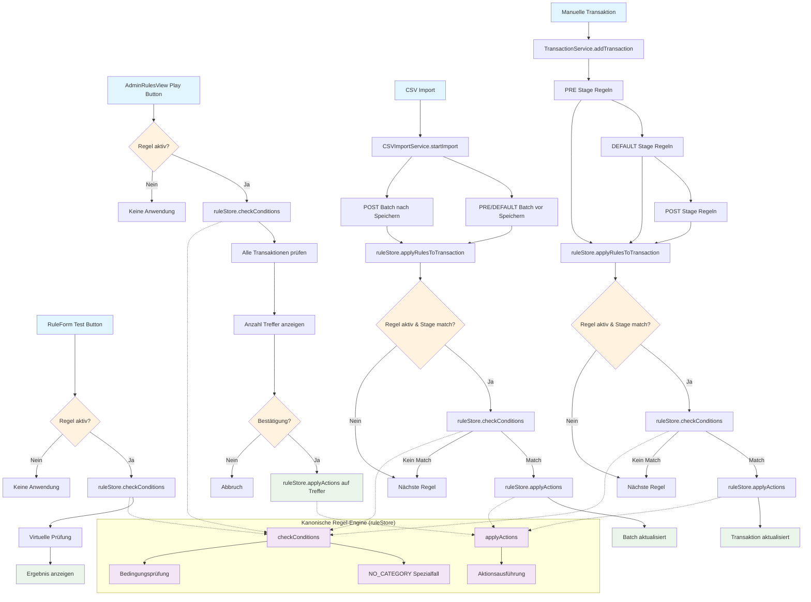
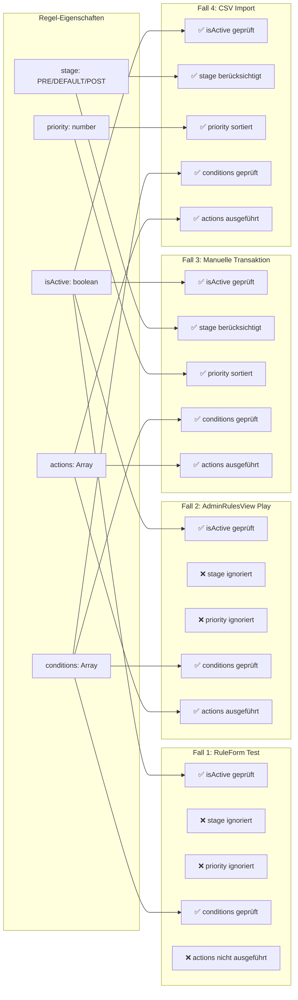

# FinWise Automatisierungsregeln - Anwendungsfälle Diagramm

## Übersicht der vier Regel-Anwendungsfälle

## Regel-Felder Berücksichtigung

## Kritische Erkenntnisse

### ✅ Behobenes Problem
- **AdminRulesView** verwendete eigene `checkConditions`-Implementierung ohne `NO_CATEGORY` Spezialfall
- **Lösung**: Ersetzt durch kanonische `ruleStore.checkConditions()`

### 🔍 Unterschiede zwischen Fällen

| Aspekt | RuleForm Test | AdminRulesView Play | Manuelle Transaktion | CSV Import |
|--------|---------------|-------------------|---------------------|------------|
| **isActive** | ✅ Geprüft | ✅ Geprüft | ✅ Geprüft | ✅ Geprüft |
| **stage** | ❌ Ignoriert | ❌ Ignoriert | ✅ PRE/DEFAULT/POST | ✅ PRE/DEFAULT/POST |
| **priority** | ❌ Ignoriert | ❌ Ignoriert | ✅ Sortiert | ✅ Sortiert |
| **conditions** | ✅ Virtuell | ✅ Real | ✅ Real | ✅ Real |
| **actions** | ❌ Nur Test | ✅ Ausgeführt | ✅ Ausgeführt | ✅ Ausgeführt |

### 📋 Empfehlungen

1. **Konsistenz**: Alle Fälle verwenden jetzt dieselbe `checkConditions`-Implementierung
2. **NO_CATEGORY**: Funktioniert jetzt in allen Fällen korrekt
3. **Testing**: RuleForm Test sollte auch `stage` und `priority` berücksichtigen (optional)
4. **AdminRulesView**: Könnte optional auch `stage`-Filter anbieten
