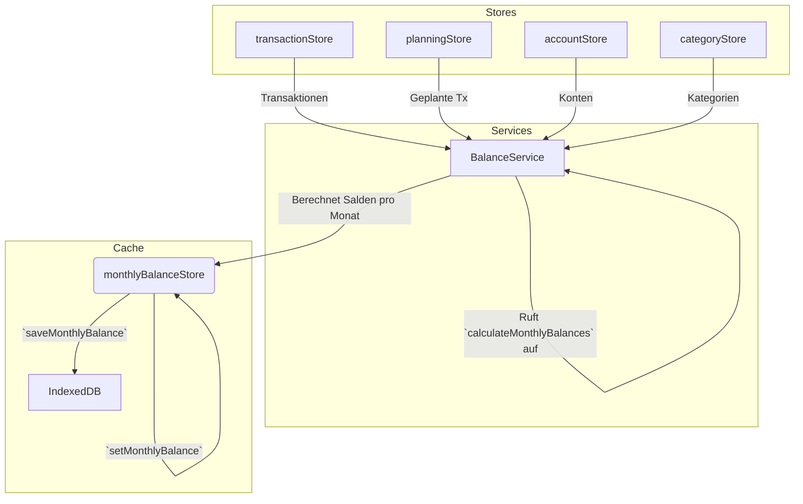

# Dokumentation: `monthlyBalanceStore.ts`

## 1. Zusammenfassung

Der `monthlyBalanceStore` ist ein zentraler **Performance-Cache** innerhalb der FinWise-Anwendung. Sein Hauptzweck ist es, die rechenintensiven Aufgaben der Saldenberechnung zu optimieren. Anstatt bei jeder Anfrage die Salden für Konten und Kategorien aus potenziell Tausenden von Einzeltransaktionen neu zu berechnen, aggregiert dieser Store die Salden auf monatlicher Basis.

Er speichert sowohl die **Ist-Salden** (basierend auf tatsächlichen Transaktionen) als auch **prognostizierte Salden**, die zukünftige, geplante Buchungen (`planningTransactions`) miteinbeziehen. Dies ermöglicht extrem schnelle Abfragen für Monatsübersichten, Diagramme und Prognosen.

## 2. Datenstruktur (`MonthlyBalance` Interface)

Das Herzstück des Stores ist das `MonthlyBalance`-Interface, das die aggregierten Daten für ein einzelnes Jahr und einen Monat enthält.

```typescript
export interface MonthlyBalance {
  year: number; // Das Jahr (z.B. 2023)
  month: number; // Der Monat (0-basiert, 0 = Januar)

  // Ist-Salden zum Monatsende
  accountBalances: Record<string, number>; // { [accountId]: balance }
  categoryBalances: Record<string, number>; // { [categoryId]: balance }

  // Prognostizierte Salden zum Monatsende
  projectedAccountBalances: Record<string, number>; // { [accountId]: projectedBalance }
  projectedCategoryBalances: Record<string, number>; // { [categoryId]: projectedBalance }

  // Metadaten
  lastCalculated?: string; // ISO-Timestamp der letzten Berechnung
}
```

- **`accountBalances`**: Ein Objekt, das die Endsalden aller Konten am letzten Tag des Monats enthält.
- **`categoryBalances`**: Ein Objekt, das die Endsalden aller Kategorien am letzten Tag des Monats enthält.
- **`projected...`**: Dieselbe Struktur wie die Ist-Salden, jedoch unter Einbeziehung aller geplanten Transaktionen, die in diesem Monat fällig sind.
- **`lastCalculated`**: Ein Zeitstempel, der verwendet wird, um zu entscheiden, ob eine Neuberechnung notwendig ist (siehe `BalanceService.calculateMonthlyBalancesIfNeeded`).

## 3. Datenfluss: Berechnung und Speicherung

Die Daten für den `monthlyBalanceStore` werden nicht direkt, sondern über den `BalanceService` berechnet und geschrieben. Dies stellt eine saubere Trennung der Verantwortlichkeiten sicher.

### Mermaid-Diagramm: Datenberechnung



### Prozess der Berechnung (`BalanceService.calculateMonthlyBalances`)

1.  **Trigger**: Die Berechnung wird durch `BalanceService.calculateMonthlyBalancesIfNeeded()` angestoßen, typischerweise nach dem Login oder einer größeren Datenänderung (z.B. CSV-Import). Sie läuft nur, wenn neue Transaktionen seit der letzten Berechnung existieren.
2.  **Monate sammeln**: Der Service sammelt alle Monate, in denen Transaktionen existieren, und fügt zusätzlich die nächsten 24 Monate für die Prognose hinzu.
3.  **Iteration**: Für jeden dieser Monate wird `BalanceService.calculateBalanceForMonth` aufgerufen.
4.  **Saldo-Berechnung**:
    *   **Ist-Salden**: Alle Transaktionen bis zum Monatsende werden aus dem `transactionStore` geholt und pro Konto/Kategorie aufsummiert.
    *   **Prognose-Salden**: Die Berechnung der prognostizierten Salden ist rekursiv. Sie nimmt den prognostizierten Saldo des **Vormonats**, addiert die Differenz der **Ist-Salden** des aktuellen Monats und addiert die **geplanten Transaktionen** (`planningStore`) für den aktuellen Monat.
5.  **Speicherung im State**: Der berechnete `MonthlyBalance`-Datensatz wird mittels `monthlyBalanceStore.setMonthlyBalance()` im Pinia-State gespeichert.
6.  **Persistenz in IndexedDB**: Gleichzeitig wird derselbe Datensatz über den `TenantDbService` in der `monthlyBalances`-Tabelle der IndexedDB des aktuellen Mandanten gespeichert, um die Daten offline verfügbar zu machen.

## 4. Datenfluss: Abfrage

UI-Komponenten greifen **nie direkt** auf den `monthlyBalanceStore` zu. Sie verwenden immer den `BalanceService` als Abstraktionsschicht.

### Mermaid-Diagramm: Datenabfrage

```mermaid
flowchart TD
    subgraph UI
        A[Vue Component (z.B. Budget-Übersicht)]
    end

    subgraph Services
        B[BalanceService]
    end

    subgraph Cache & Stores
      C(monthlyBalanceStore)
      D[transactionStore]
    end

    A -- `getBalance(category, date)` --> B
    B -- `getMonthlyBalance(year, month)` --> C
    C -- Daten gefunden --> B
    B -- Gibt gecachten Saldo zurück --> A

    subgraph Fallback-Pfad
      B -- `getMonthlyBalance(year, month)` --> C
      C -- Daten NICHT gefunden --> B
      B -- Berechnet Saldo direkt --> D
      D -- Transaktionen --> B
      B -- Gibt neu berechneten Saldo zurück --> A
    end
```

### Prozess der Abfrage

1.  **Anfrage**: Eine Komponente benötigt einen Saldo, z.B. über `BalanceService.getTodayBalance('category', 'cat-123')`.
2.  **Cache-Prüfung**: Der `BalanceService` versucht zuerst, den Wert aus dem `monthlyBalanceStore` zu lesen, indem er `monthlyBalanceStore.getMonthlyBalance(year, month)` aufruft.
3.  **Erfolgsfall (Cache Hit)**: Wenn ein Datensatz für den Monat existiert, wird der entsprechende Saldo aus `accountBalances` oder `categoryBalances` extrahiert und sofort zurückgegeben. Dies ist der schnelle Standardfall.
4.  **Fehlschlag (Cache Miss)**: Wenn für den angefragten Monat kein Datensatz im Store existiert, führt der `BalanceService` eine **Fallback-Berechnung** durch. Er greift direkt auf den `transactionStore` zu, filtert alle relevanten Transaktionen und berechnet den Saldo "on-the-fly". Dies ist langsamer, stellt aber sicher, dass immer ein korrekter Wert zurückgegeben wird.

## 5. Lebenszyklus und Persistenz

-   **Laden**: Beim Start der App oder beim Wechsel eines Mandanten wird `monthlyBalanceStore.loadMonthlyBalances()` (via `DataService.reloadTenantData`) aufgerufen. Dies lädt alle persistenten Monatsbilanzen aus der IndexedDB in den Pinia-State.
-   **Speichern**: Jede Aktualisierung über `setMonthlyBalance` schreibt die Daten sofort wieder in die IndexedDB. Dies stellt sicher, dass der Cache auch nach einem Neuladen der Seite aktuell ist.
-   **Reset**: Beim Mandantenwechsel oder Logout wird `monthlyBalanceStore.reset()` aufgerufen, was den In-Memory-State leert und anschließend neu aus der IndexedDB des (neuen) Mandanten befüllt.

## 6. Legacy-Aspekte: Migration von localStorage

Die Funktion `migrateFromLocalStorage` im Store zeigt, dass diese Daten früher im `localStorage` gespeichert wurden. Bei der ersten Initialisierung nach dem Update auf die IndexedDB-Version werden die alten Daten einmalig in die IndexedDB migriert und anschließend aus dem `localStorage` gelöscht, um die Umstellung abzuschließen.
