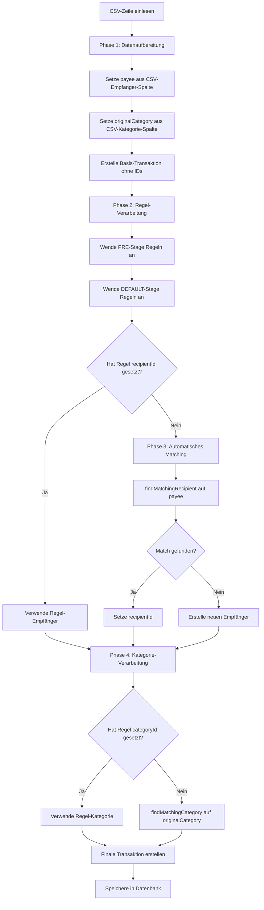

# CSV-Import Regel-First-Architektur

## Problemstellung

Im aktuellen CSV-Import-Service erfolgt die Empfängerzuordnung vor der Regelanwendung, wodurch Regeln, die auf das `payee`-Feld abzielen, nicht greifen können. Dies führt dazu, dass falsch benannte Empfänger wie "Amazon xyz" angelegt werden, obwohl eine Regel existiert, die sie auf "Amazon" mappen sollte.

## Lösungsansatz: Zwei-Phasen-Verarbeitung

### Architektur-Diagramm



### Detaillierte Implementierung

#### 1. Erweiterte TypeScript-Typen

```typescript
// Neue Regel-Aktion für Empfänger-Zuordnung
export enum RuleActionType {
  SET_CATEGORY = 'SET_CATEGORY',
  SET_RECIPIENT = 'SET_RECIPIENT', // NEU
  ADD_TAG = 'ADD_TAG',
  SET_NOTE = 'SET_NOTE'
}

// Erweiterte Transaktionsdaten für CSV-Import
interface CSVTransactionData extends Omit<Transaction, 'id' | 'runningBalance'> {
  payee: string;                    // Immer aus CSV gesetzt
  originalCategory?: string;        // Kategorie-Klartext aus CSV
  originalRecipientName?: string;   // Empfänger-Klartext aus CSV (Alias für payee)
  _skipAutoRecipientMatching?: boolean; // Flag für Regel-gesteuerte Empfänger
  _skipAutoCategoryMatching?: boolean;  // Flag für Regel-gesteuerte Kategorien
}
```

#### 2. Modifizierte CSVImportService.ts

```typescript
// In startImport() - Phase 1: Datenaufbereitung
for (const item of preparedData) {
  // WICHTIG: Setze payee IMMER aus CSV-Daten, auch wenn potentieller Match existiert
  const transactionData: CSVTransactionData = {
    id: crypto.randomUUID(),
    date: item.date,
    valueDate: item.valueDate,
    accountId: item.accountId,
    amount: item.amount,
    note: item.note,
    description: item.note,

    // REGEL-RELEVANTE FELDER - immer aus CSV setzen
    payee: item.originalRecipientName || '', // Aus CSV-Empfänger-Spalte
    originalCategory: mappedColumns.value.category ?
      item[mappedColumns.value.category] : undefined,
    originalRecipientName: item.originalRecipientName, // Für Regel-Kompatibilität

    // IDs bleiben zunächst undefined - werden durch Regeln oder Matching gesetzt
    recipientId: undefined,
    categoryId: undefined,
    tagIds: item.tagIds || [],

    // Weitere Felder
    type: item.amount < 0 ? TransactionType.EXPENSE : TransactionType.INCOME,
    counterTransactionId: null,
    planningTransactionId: null,
    isReconciliation: false,
    runningBalance: 0,
    reconciled: false,
    isCategoryTransfer: false,
    transferToAccountId: null,
    toCategoryId: undefined,
    created_at: new Date().toISOString(),
    updated_at: new Date().toISOString()
  };

  transactionsToImport.push(transactionData);
}

// Phase 2: Regel-Verarbeitung (PRE + DEFAULT)
if (transactionsToImport.length > 0) {
  infoLog('CSVImportService', `Applying PRE and DEFAULT stage rules to ${transactionsToImport.length} transactions`);

  // Wende Regeln auf Transaktionen mit payee/originalCategory an
  const processedTransactions = await TransactionService.applyPreAndDefaultRulesToTransactions(transactionsToImport);

  // Ersetze ursprüngliche Transaktionen
  transactionsToImport.length = 0;
  transactionsToImport.push(...processedTransactions);
}

// Phase 3: Automatisches Matching nur für Transaktionen ohne Regel-Zuordnung
for (const tx of transactionsToImport) {
  // Empfänger-Matching nur wenn keine Regel recipientId gesetzt hat
  if (!tx.recipientId && !tx._skipAutoRecipientMatching && tx.payee) {
    const matchResult = await performRecipientMatching(tx.payee);
    if (matchResult) {
      if (typeof matchResult === 'string') {
        // Neuen Empfänger erstellen
        const newRecipient = await recipientStore.addRecipient({ name: matchResult });
        tx.recipientId = newRecipient.id;
      } else {
        // Existierenden Empfänger verwenden
        tx.recipientId = matchResult.id;
      }
    }
  }

  // Kategorie-Matching nur wenn keine Regel categoryId gesetzt hat
  if (!tx.categoryId && !tx._skipAutoCategoryMatching && tx.originalCategory) {
    const categoryMatch = await performCategoryMatching(tx.originalCategory);
    if (categoryMatch) {
      tx.categoryId = categoryMatch.id;
    }
  }
}
```

#### 3. Erweiterte Regel-Engine (ruleStore.ts)

```typescript
// Neue Regel-Aktion für Empfänger-Zuordnung
function applyActions(rule: AutomationRule, tx: CSVTransactionData): CSVTransactionData {
  const out = { ...tx };

  rule.actions.forEach((action) => {
    switch (action.type) {
      case RuleActionType.SET_CATEGORY:
        if (!tx.isCategoryTransfer && !tx.counterTransactionId) {
          out.categoryId = String(action.value);
          out._skipAutoCategoryMatching = true; // Verhindere automatisches Matching
        }
        break;

      case RuleActionType.SET_RECIPIENT:
        // Suche Empfänger nach Name
        const recipientStore = useRecipientStore();
        const recipient = recipientStore.recipients.find(r =>
          r.name.toLowerCase() === String(action.value).toLowerCase()
        );

        if (recipient) {
          out.recipientId = recipient.id;
          out._skipAutoRecipientMatching = true; // Verhindere automatisches Matching
          debugLog('RuleStore', `Regel "${rule.name}" setzte Empfänger: ${recipient.name} (${recipient.id})`);
        } else {
          warnLog('RuleStore', `Regel "${rule.name}" konnte Empfänger "${action.value}" nicht finden`);
        }
        break;

      case RuleActionType.ADD_TAG:
        if (!out.tagIds) out.tagIds = [];
        if (Array.isArray(action.value)) {
          out.tagIds = [...new Set([...out.tagIds, ...action.value])];
        } else if (!out.tagIds.includes(String(action.value))) {
          out.tagIds.push(String(action.value));
        }
        break;

      case RuleActionType.SET_NOTE:
        out.note = String(action.value);
        break;
    }
  });

  return out;
}

// Erweiterte Bedingungsprüfung für CSV-Import
function checkConditions(conditions: any[], tx: CSVTransactionData): boolean {
  if (!conditions?.length) return true;

  return conditions.every((condition) => {
    const source = condition.source || '';
    const operator = condition.operator || 'is';
    const value = condition.value;

    let txValue: any = null;

    switch (source) {
      case 'account':
        txValue = tx.accountId;
        break;
      case 'recipient':
        // Verwende payee für Empfänger-Bedingungen (nicht recipientId)
        txValue = tx.payee || '';
        break;
      case 'originalRecipient': // Neue Bedingung für CSV-Import
        txValue = tx.originalRecipientName || tx.payee || '';
        break;
      case 'category':
        // Für Kategorie-Bedingungen: erst originalCategory, dann categoryId
        if (condition.operator === 'is' && value === 'NO_CATEGORY') {
          return !tx.categoryId && !tx.originalCategory;
        }
        txValue = tx.originalCategory || tx.categoryId || '';
        break;
      case 'amount':
        txValue = tx.amount;
        break;
      case 'date':
        txValue = tx.date;
        break;
      case 'valueDate':
        txValue = tx.valueDate || tx.date;
        break;
      case 'description':
        txValue = tx.note || '';
        break;
      default:
        return false;
    }

    // Operator-basierte Auswertung
    switch (operator) {
      case 'is':
        return String(txValue).toLowerCase() === String(value).toLowerCase();
      case 'contains':
        return String(txValue).toLowerCase().includes(String(value).toLowerCase());
      case 'starts_with':
        return String(txValue).toLowerCase().startsWith(String(value).toLowerCase());
      case 'ends_with':
        return String(txValue).toLowerCase().endsWith(String(value).toLowerCase());
      case 'greater':
        return Number(txValue) > Number(value);
      case 'greater_equal':
        return Number(txValue) >= Number(value);
      case 'less':
        return Number(txValue) < Number(value);
      case 'less_equal':
        return Number(txValue) <= Number(value);
      case 'approx':
        const txNum = Number(txValue);
        const valNum = Number(value);
        const tolerance = Math.abs(valNum * 0.1);
        return Math.abs(txNum - valNum) <= tolerance;
      default:
        return false;
    }
  });
}
```

#### 4. Hilfsfunktionen für Matching

```typescript
// In CSVImportService.ts - Refactored Matching-Funktionen
async function performRecipientMatching(recipientName: string): Promise<string | { id: string, name: string } | null> {
  if (!recipientName) return null;

  // Direkter Match (case-insensitive)
  const directMatch = recipientStore.recipients.find(
    r => r.name && r.name.toLowerCase() === recipientName.toLowerCase().trim()
  );

  if (directMatch) {
    debugLog('CSVImportService', `Direkter Empfänger-Match: "${recipientName}" -> ${directMatch.name}`);
    return directMatch;
  }

  // Fuzzy-Match mit hohem Schwellwert
  const fuzzyMatches = recipientStore.recipients
    .map(recipient => ({
      ...recipient,
      similarity: calculateStringSimilarity(recipient.name, recipientName)
    }))
    .filter(match => match.similarity > 0.8)
    .sort((a, b) => b.similarity - a.similarity);

  if (fuzzyMatches.length > 0) {
    debugLog('CSVImportService', `Fuzzy-Match Empfänger: "${recipientName}" -> ${fuzzyMatches[0].name} (${fuzzyMatches[0].similarity})`);
    return { id: fuzzyMatches[0].id, name: fuzzyMatches[0].name };
  }

  // Kein Match gefunden - Name für neue Empfänger-Erstellung zurückgeben
  debugLog('CSVImportService', `Kein Empfänger-Match für "${recipientName}" - wird als neuer Empfänger erstellt`);
  return recipientName;
}

async function performCategoryMatching(categoryName: string): Promise<{ id: string, name: string } | null> {
  if (!categoryName) return null;

  // Direkter Match
  const directMatch = categoryStore.categories.find(
    c => c.name && c.name.toLowerCase() === categoryName.toLowerCase()
  );

  if (directMatch) {
    debugLog('CSVImportService', `Direkter Kategorie-Match: "${categoryName}" -> ${directMatch.name}`);
    return directMatch;
  }

  // Fuzzy-Match
  const fuzzyMatches = categoryStore.categories
    .map(category => ({
      ...category,
      similarity: calculateStringSimilarity(category.name, categoryName)
    }))
    .filter(match => match.similarity > 0.8)
    .sort((a, b) => b.similarity - a.similarity);

  if (fuzzyMatches.length > 0) {
    debugLog('CSVImportService', `Fuzzy-Match Kategorie: "${categoryName}" -> ${fuzzyMatches[0].name} (${fuzzyMatches[0].similarity})`);
    return { id: fuzzyMatches[0].id, name: fuzzyMatches[0].name };
  }

  debugLog('CSVImportService', `Kein Kategorie-Match für "${categoryName}"`);
  return null;
}
```

## Beispiel-Szenario

### Vorher (Problematisch)
1. CSV enthält: `"Amazon xyz GmbH & Co KG"`
2. `findMatchingRecipient()` findet Fuzzy-Match mit "Amazon" (similarity > 0.6)
3. `row.recipientId` wird auf "Amazon" gesetzt
4. `payee` bleibt leer, da `recipientId` existiert
5. Regel kann nicht greifen, da `payee` leer ist
6. **Resultat:** Korrekte Zuordnung, aber Regel wird ignoriert

### Nachher (Regel-First)
1. CSV enthält: `"Amazon xyz GmbH & Co KG"`
2. `payee` wird auf "Amazon xyz GmbH & Co KG" gesetzt
3. Regel mit Bedingung `recipient contains "Amazon"` greift
4. Regel-Aktion `SET_RECIPIENT: "Amazon"` wird ausgeführt
5. `recipientId` wird auf "Amazon" gesetzt
6. `_skipAutoRecipientMatching = true` verhindert automatisches Matching
7. **Resultat:** Regel-gesteuerte Zuordnung, kein neuer falscher Empfänger

## Vorteile

1. **Regel-Priorität:** Regeln haben immer Vorrang vor automatischem Matching
2. **Verhindert falsche Empfänger:** Regeln können verhindern, dass "Amazon xyz" als neuer Empfänger angelegt wird
3. **Rückwärtskompatibilität:** Bestehende Funktionalität bleibt vollständig erhalten
4. **Flexibilität:** Benutzer kann zwischen Regel-basierter und automatischer Zuordnung wählen
5. **Konsistenz:** Gleiche Logik für Empfänger und Kategorien
6. **Performance:** Nur eine Regelanwendung pro Transaktion
7. **Testbarkeit:** Klare Trennung der Verarbeitungsphasen

## Implementierungsaufwand

- **Aufwand:** Gering - hauptsächlich Umordnung bestehender Logik
- **Risiko:** Niedrig - bestehende Funktionalität bleibt erhalten
- **Testaufwand:** Mittel - neue Regel-Aktionen müssen getestet werden
- **Rollback:** Einfach - durch Feature-Flag steuerbar

## Migration

1. **Phase 1:** Neue Regel-Aktion `SET_RECIPIENT` implementieren
2. **Phase 2:** CSV-Import-Logik umstellen (mit Feature-Flag)
3. **Phase 3:** Bestehende Regeln können optional erweitert werden
4. **Phase 4:** Feature-Flag entfernen nach erfolgreicher Validierung
