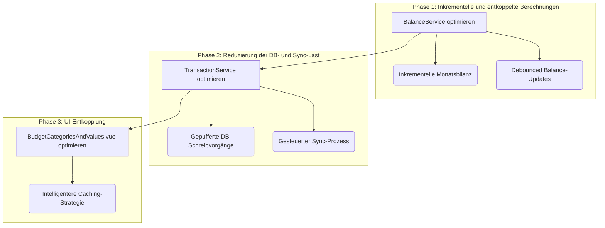

# Umsetzungsplan: Performance-Optimierung Budget-Modul

Dieses Dokument beschreibt den Plan zur Behebung von Performance-Engpässen im Budget-Modul, die bei einer großen Anzahl von Kategorien (>50) auftreten.

## Analyse der Engpässe

Die Hauptursachen für die Performance-Probleme sind:

1.  **Redundante Daten-Aggregation:** Bei jeder Budget-Änderung werden die Salden und Zusammenfassungen für **alle** Kategorien und Monate neu berechnet, anstatt nur die geänderten Daten zu aktualisieren.
2.  **Kaskadierende Neuberechnungen:** Eine einzelne Änderung löst eine Kaskade von Neuberechnungen aus, die von der UI (`BudgetCategoriesAndValues.vue`) über die Services (`BudgetService`, `TransactionService`, `BalanceService`) bis hin zur Datenbank reicht.
3.  **Häufige DB- und Sync-Operationen:** Jede Budget-Anpassung erzeugt mindestens zwei Transaktionen, die sofort einzeln in IndexedDB geschrieben und für die Synchronisation vorgemerkt werden, was bei schnellen Änderungen zu einem "I/O-Stau" führt.

## Umsetzungsplan

Der Plan ist in drei Phasen unterteilt, um die Probleme gezielt zu adressieren.

---

### **Phase 1: Inkrementelle und entkoppelte Berechnungen (`BalanceService`)**

**Ziel:** Die teure `calculateMonthlyBalances`-Funktion durch eine intelligente, inkrementelle Aktualisierung ersetzen.

**1.1. Inkrementelle Monatsbilanz-Aktualisierung:**
*   **Aktion:** Neue Methode `BalanceService.updateMonthlyBalancesForChanges(changes: { accountIds?: string[], categoryIds?: string[], fromDate: string })` erstellen.
*   **Logik:**
    *   Die Methode iteriert von `fromDate` bis zum letzten bekannten Planungsmonat.
    *   In jeder Iteration (pro Monat) berechnet sie **nur** die Salden für die übergebenen `accountIds` und `categoryIds` neu.
    *   Bestehende, unberührte Salden in diesem Monat werden beibehalten.
*   **Vorteil:** Drastische Reduktion des Berechnungsaufwands (>98%).

**1.2. Debounced Balance-Updates:**
*   **Aktion:** Eine neue Klasse `MonthlyBalanceUpdateQueue` in `BalanceService.ts` implementieren, analog zur bestehenden `RunningBalanceQueue`.
*   **Logik:**
    *   Die Queue sammelt geänderte `accountId`s, `categoryId`s und das früheste `fromDate`.
    *   Ein Debounce-Timer (z.B. 200ms) bündelt die Aufrufe.
    *   Nach Ablauf wird `updateMonthlyBalancesForChanges` einmalig mit allen gesammelten Änderungen aufgerufen.
*   **Integration:** Alle Aufrufe von `BalanceService.calculateMonthlyBalances()` im `TransactionService` werden durch `monthlyBalanceUpdateQueue.enqueueUpdate(...)` ersetzt.

---

### **Phase 2: Reduzierung der DB- und Sync-Last (`TransactionService`)**

**Ziel:** Die Last auf IndexedDB und das Netzwerk bei schnellen, aufeinanderfolgenden Aktionen reduzieren.

**2.1. Gepufferte IndexedDB-Schreibvorgänge:**
*   **Aktion:** Den `transactionStore` und `TenantDbService` anpassen.
*   **Logik:**
    1.  `transactionStore.addTransaction` fügt neue Transaktionen einem temporären In-Memory-Array (`pendingTransactions`) hinzu. Die UI ist sofort aktuell.
    2.  Ein Debouncer (z.B. 1-3 Sekunden) sammelt diese.
    3.  Eine neue Methode `TenantDbService.bulkAddTransactions(pendingTransactions)` schreibt alle wartenden Transaktionen in einer einzigen DB-Transaktion.
*   **Vorteil:** Reduziert den "I/O-Stau" durch Bündelung vieler kleiner Schreiboperationen.

**2.2. Gesteuerter Synchronisationsprozess:**
*   **Aktion:** Den `WebSocketService` anpassen.
*   **Logik:**
    1.  Ein `setInterval` (z.B. alle 10-30 Sekunden) prüft die `SyncQueue` in IndexedDB.
    2.  Wenn Einträge vorhanden sind, werden sie paketiert (z.B. 10-20 pro Paket) und an das Backend gesendet.
*   **Vorteil:** Entkoppelt den Sync von der UI-Interaktion und macht die Netzwerklast planbarer.

---

### **Phase 3: UI-Entkopplung (`BudgetCategoriesAndValues.vue`)**

**Ziel:** Die rechenintensive Neuberechnung des `typeSummaryCache` verhindern.

**3.1. Intelligentere Caching-Strategie:**
*   **Aktion:** Die `computed` Property `typeSummaryCache` durch eine reaktive `ref` und einen `watch`-Hook ersetzen.
*   **Logik:**
    1.  Der Cache wird als `ref(new Map())` initialisiert.
    2.  Ein `watch` beobachtet den `monthlyBalanceStore`.
    3.  Bei Änderungen wird **nur der Cache-Eintrag für den spezifischen Monat** aktualisiert. Die Daten werden direkt aus dem `monthlyBalanceStore` bezogen, nicht neu aggregiert.
*   **Vorteil:** Verhindert das teure Neurendern der gesamten Ansicht bei kleinen Datenänderungen.
