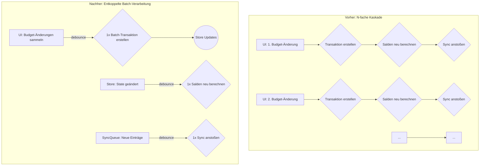

# Plan zur Performance-Optimierung der Budget-Funktion

## Problembeschreibung

Die Analyse der Logs und der Architektur hat die Ursache für das Performance-Problem bei der Budget-Bearbeitung bestätigt. Jede einzelne Budget-Anpassung löst eine Kaskade von teuren Operationen aus, die sich bei mehreren Änderungen schnell aufsummieren und die Anwendung erheblich verlangsamen.

- **Kaskadierende Updates:** Jede Budgetänderung in `BudgetCategoriesAndValues.vue` erzeugt zwei Transaktionen über `TransactionService.addCategoryTransfer()`.
- **Intensive Neuberechnungen:** Jede dieser Transaktionen löst eine sofortige, aufwändige Neuberechnung aller Monatsbilanzen durch `BalanceService.calculateMonthlyBalances()` aus.
- **"Chatty" Synchronisation:** Jede Transaktion wird einzeln in die Sync Queue gestellt, was den `WebSocketService` zu häufig und ineffizient anstößt.

Bei 5 Budgetänderungen führt dies zu 10 Transaktionen, 10 kompletten Saldo-Neuberechnungen und 10 separaten Sync-Vorgängen. Dies blockiert die UI und verzögert die Synchronisation erheblich.

## Lösungsstrategie: Entkopplung und Batch-Verarbeitung

Ich schlage vor, die Interaktionen zwischen der UI, den Services und den Stores zu entkoppeln und die Berechnungen zu optimieren.

### 1. `BudgetCategoriesAndValues.vue`: Batch-Verarbeitung einführen

- Wir führen einen **Batch-Modus** ein. Anstatt jede Budget-Änderung sofort zu verarbeiten, sammeln wir sie in einer lokalen Liste (`pendingBudgetUpdates`).
- Die Verarbeitung wird durch einen `debounce`-Mechanismus ausgelöst, d.h., sie startet erst, wenn der Benutzer für kurze Zeit keine neuen Eingaben macht.
- Dies reduziert die Anzahl der Aufrufe an den `TransactionService` von N auf 1 pro Bearbeitungssitzung.

### 2. `TransactionService`: Optimierung der Transaktionserstellung

- Ich werde eine neue Methode `addBulkCategoryTransfers` hinzufügen, die eine Liste von Budget-Änderungen in einer einzigen, performanten Operation verarbeiten kann.
- Diese Methode wird einen Batch-Update-Modus im `transactionStore` nutzen, um UI-Updates während der Massenverarbeitung zu verhindern.

### 3. `BalanceService`: Intelligente und verzögerte Neuberechnung

- Die sofortige und wiederholte Ausführung von `calculateMonthlyBalances()` wird entfernt.
- Stattdessen wird die Neuberechnung der Salden ebenfalls über einen `debounce`-Mechanismus gesteuert und nur einmal nach Abschluss aller Änderungen ausgeführt. Dies reduziert die Last auf die IndexedDB erheblich.

### 4. `WebSocketService`: Effizientere Synchronisation

- Die Logik zur Verarbeitung der `SyncQueue` wird nicht mehr durch jede einzelne Transaktion getriggert, sondern durch einen `watch`-Mechanismus auf der `syncQueue` selbst.
- Dieser Watcher wird ebenfalls einen `debounce` verwenden, um sicherzustellen, dass nicht zu viele Sync-Prozesse gleichzeitig gestartet werden. Das "Chattern" wird unterbunden.

## Visueller Vergleich: Vorher vs. Nachher

Dieser Plan sorgt dafür, dass die UI reaktionsschnell bleibt, die Datenbanklast minimiert und die Synchronisation effizient und gebündelt abläuft.
