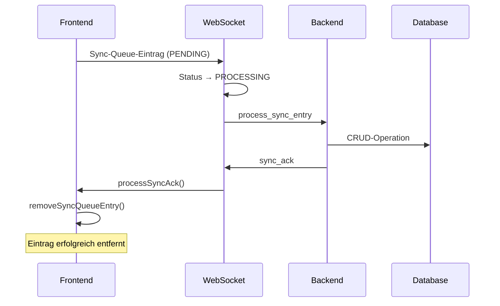
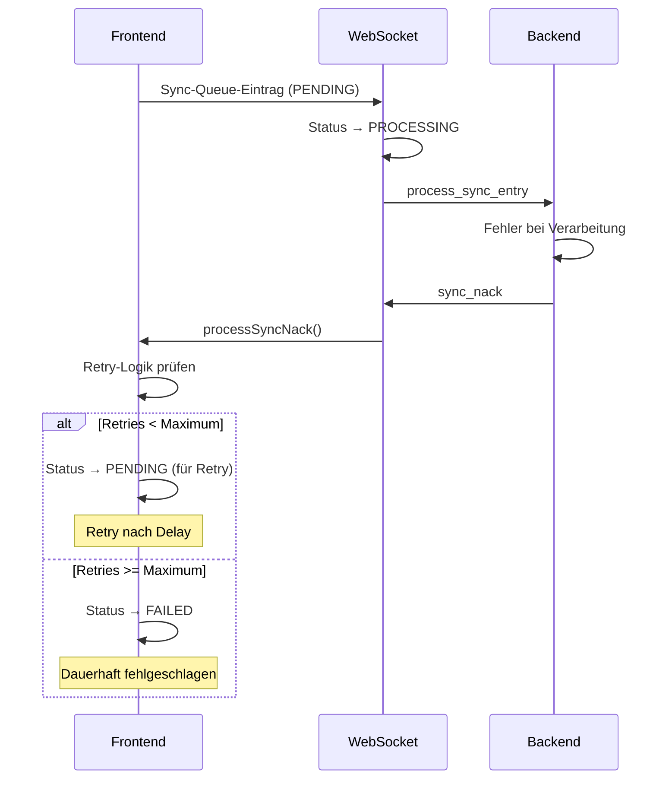

# Sync-Acknowledgment-System

## Übersicht

Das Sync-Acknowledgment-System stellt sicher, dass Sync-Queue-Einträge nach erfolgreicher Synchronisation entfernt und bei Fehlern mit einem robusten Retry-Mechanismus behandelt werden.

## Architektur

### Frontend-Komponenten

#### 1. Erweiterte TypeScript-Typen (`src/types/index.ts`)

```typescript
// Sync-Acknowledgment-Nachrichten vom Server
export interface SyncAckMessage extends WebSocketMessageBase {
  type: 'sync_ack';
  id: string; // SyncQueueEntry.id
  status: 'processed';
  entityId: string;
  entityType: EntityTypeEnum;
  operationType: SyncOperationType;
}

export interface SyncNackMessage extends WebSocketMessageBase {
  type: 'sync_nack';
  id: string; // SyncQueueEntry.id
  status: 'failed';
  entityId: string;
  entityType: EntityTypeEnum;
  operationType: SyncOperationType;
  reason: string; // Kurzer Grund für den Fehler
  detail?: string; // Detaillierte Fehlermeldung
}
```

#### 2. Erweiterte TenantDbService (`src/services/TenantDbService.ts`)

**Neue Methoden:**
- `removeSyncQueueEntry(entryId: string)`: Entfernt einen Sync-Queue-Eintrag
- `getSyncQueueEntry(entryId: string)`: Ruft einen spezifischen Sync-Queue-Eintrag ab
- `getFailedSyncEntries(tenantId: string, maxRetries: number)`: Ruft fehlgeschlagene Einträge ab
- `getProcessingSyncEntries(tenantId: string)`: Ruft verarbeitende Einträge ab
- `resetStuckProcessingEntries(tenantId: string, timeoutMs: number)`: Setzt hängende PROCESSING-Einträge zurück

#### 3. Erweiterte WebSocketService (`src/services/WebSocketService.ts`)

**Neue Methoden:**
- `processSyncAck(ackMessage: SyncAckMessage)`: Verarbeitet Sync-Bestätigungen
- `processSyncNack(nackMessage: SyncNackMessage)`: Verarbeitet Sync-Fehler
- `initializeSyncQueue()`: Initialisiert die Sync-Queue beim Start
- `getMaxRetriesForReason(reason: string)`: Bestimmt maximale Retry-Anzahl basierend auf Fehlergrund
- `calculateRetryDelay(attemptNumber: number)`: Berechnet Retry-Delay mit exponential backoff

## Workflow

### 1. Erfolgreiche Synchronisation (ACK)



### 2. Fehlgeschlagene Synchronisation (NACK)



## Retry-Mechanismus

### Retry-Strategien basierend auf Fehlergrund

| Fehlergrund | Max Retries | Beschreibung |
|-------------|-------------|--------------|
| `validation_error` | 1 | Strukturelle Fehler - nur ein Retry |
| `table_not_found` | 1 | Strukturelle Fehler - nur ein Retry |
| `database_operational_error` | 5 | Datenbankfehler - mehr Retries |
| `processing_error` | 3 | Allgemeine Verarbeitungsfehler |
| `generic_processing_error` | 3 | Allgemeine Verarbeitungsfehler |
| Standard | 3 | Standard-Retry-Anzahl |

### Exponential Backoff

```typescript
calculateRetryDelay(attemptNumber: number): number {
  // Exponential backoff: 2^attemptNumber * 1000ms, max 30 Sekunden
  const baseDelay = 1000; // 1 Sekunde
  const maxDelay = 30000; // 30 Sekunden
  const delay = Math.min(baseDelay * Math.pow(2, attemptNumber), maxDelay);

  // Jitter hinzufügen (±25% Variation)
  const jitter = delay * 0.25 * (Math.random() - 0.5);
  return Math.round(delay + jitter);
}
```

**Retry-Delays:**
- Versuch 1: ~1s (±250ms)
- Versuch 2: ~2s (±500ms)
- Versuch 3: ~4s (±1s)
- Versuch 4: ~8s (±2s)
- Versuch 5+: ~30s (±7.5s)

## Robuste Fehlerbehandlung

### 1. Hängende PROCESSING-Einträge

**Problem:** Einträge bleiben im PROCESSING-Status, wenn die Verbindung abbricht.

**Lösung:** `resetStuckProcessingEntries()` setzt Einträge zurück, die länger als 30 Sekunden im PROCESSING-Status sind.

```typescript
// Beim WebSocket-Service-Start
await this.initializeSyncQueue();
```

### 2. Graceful Degradation

**Offline-Verhalten:**
- Sync-Queue sammelt Änderungen
- Bei Reconnect werden ausstehende Einträge verarbeitet
- Hängende Einträge werden automatisch zurückgesetzt

**Verbindungsabbruch:**
- Einträge bleiben in Queue für späteren Retry
- Keine Datenverluste durch robuste Persistierung

### 3. Dead Letter Queue

Einträge, die die maximale Retry-Anzahl erreichen:
- Status: `FAILED`
- Verbleiben in der Queue für manuelle Überprüfung
- Können später manuell zurückgesetzt werden

## Backend-Integration

### Sync-Bestätigungen (`../FinWise_0.4_BE/app/websocket/endpoints.py`)

```python
# Bei erfolgreicher Verarbeitung
ack_message = SyncAckMessage(
    id=sync_entry_message.payload.id,
    entityId=sync_entry_message.payload.entityId,
    entityType=sync_entry_message.payload.entityType,
    operationType=sync_entry_message.payload.operationType
)
await manager.send_personal_json_message(ack_message.model_dump(), websocket)

# Bei Fehlschlag
nack_message = SyncNackMessage(
    id=sync_entry_message.payload.id,
    entityId=sync_entry_message.payload.entityId,
    entityType=sync_entry_message.payload.entityType,
    operationType=sync_entry_message.payload.operationType,
    reason=reason_or_detail,
    detail=f"Failed to process sync entry {sync_entry_message.payload.id}"
)
await manager.send_personal_json_message(nack_message.model_dump(), websocket)
```

## Test-Szenarien

### 1. Erfolgreiche Online-Sync
```typescript
// Test: Eintrag wird erstellt, verarbeitet, bestätigt und entfernt
await syncAckTester.testSyncAckProcessing();
```

### 2. Fehlgeschlagene Sync
```typescript
// Test: Eintrag wird mit Retry-Mechanismus behandelt
await syncAckTester.testSyncNackProcessing();
```

### 3. Offline-zu-Online
```typescript
// Test: Queue wird bei Reconnect abgearbeitet und bestätigt
await syncAckTester.testQueueCleanup();
```

### 4. Verbindungsabbruch
```typescript
// Test: Einträge bleiben in Queue für späteren Retry
await syncAckTester.testStuckProcessingReset();
```

## Verwendung

### Automatische Initialisierung

```typescript
// In main.ts oder App.vue
WebSocketService.initialize();
```

### Manuelle Tests

```typescript
import { syncAckTester } from '@/test-sync-acknowledgment';

// Alle Tests ausführen
await syncAckTester.runAllTests();

// Einzelne Tests
await syncAckTester.testSyncAckProcessing();
await syncAckTester.testRetryMechanism();
```

### Monitoring

```typescript
// Ausstehende Einträge prüfen
const pendingEntries = await tenantDbService.getPendingSyncEntries(tenantId);
const failedEntries = await tenantDbService.getFailedSyncEntries(tenantId);

console.log(`Pending: ${pendingEntries.length}, Failed: ${failedEntries.length}`);
```

## Logging

Das System verwendet strukturiertes Logging:

- **`infoLog`**: Erfolgreiche Operationen, wichtige Statusänderungen
- **`warnLog`**: Retry-Versuche, nicht-kritische Probleme
- **`errorLog`**: Kritische Fehler, dauerhaft fehlgeschlagene Operationen
- **`debugLog`**: Detaillierte Informationen für Entwicklung

## Performance-Überlegungen

### Optimierungen

1. **Batch-Verarbeitung**: Mehrere Einträge können gleichzeitig verarbeitet werden
2. **Intelligente Retry-Delays**: Exponential backoff verhindert Server-Überlastung
3. **Effiziente Queue-Abfragen**: Indizierte Datenbankabfragen für bessere Performance
4. **Memory-Management**: Automatische Bereinigung erfolgreicher Einträge

### Skalierung

- **Mandanten-Isolation**: Jeder Mandant hat seine eigene Sync-Queue
- **Parallele Verarbeitung**: Verschiedene Entity-Typen können parallel synchronisiert werden
- **Ressourcen-Limits**: Konfigurierbare Limits für Retry-Anzahl und Delays

## Wartung

### Regelmäßige Aufgaben

1. **Queue-Bereinigung**: Alte FAILED-Einträge periodisch entfernen
2. **Monitoring**: Überwachung der Queue-Größe und Fehlerrate
3. **Performance-Analyse**: Analyse der Sync-Zeiten und Retry-Muster

### Debugging

```typescript
// Queue-Status prüfen
const processingEntries = await tenantDbService.getProcessingSyncEntries(tenantId);
const failedEntries = await tenantDbService.getFailedSyncEntries(tenantId);

// Hängende Einträge zurücksetzen
const resetCount = await tenantDbService.resetStuckProcessingEntries(tenantId);
