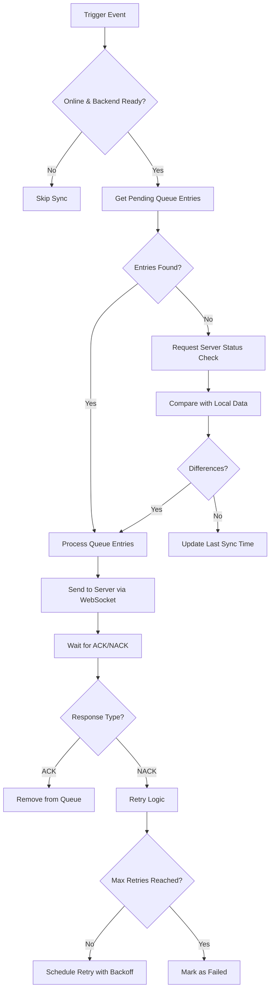

# Synchronisationssystem - Architektur-Übersicht

## Einführung

Das FinWise Synchronisationssystem implementiert ein robustes Offline-First-Konzept mit automatischer bidirektionaler Synchronisation zwischen Frontend (IndexedDB) und Backend (SQLite). Das System basiert auf einem ACK/NACK-Protokoll über WebSockets und bietet sowohl manuelle als auch automatische Synchronisationsmechanismen.

## Kernkomponenten

### 1. Frontend-Architektur

```
┌─────────────────┐    ┌──────────────────┐    ┌─────────────────┐
│   SyncButton    │    │  WebSocketStore  │    │ TenantDbService │
│     .vue        │◄──►│     (Pinia)      │◄──►│   (IndexedDB)   │
└─────────────────┘    └──────────────────┘    └─────────────────┘
         │                       │                       │
         └───────────────────────┼───────────────────────┘
                                 ▼
                    ┌──────────────────┐
                    │ WebSocketService │
                    │   (Singleton)    │
                    └──────────────────┘
                                 │
                                 ▼
                    ┌──────────────────┐
                    │   Backend API    │
                    │   (WebSocket)    │
                    └──────────────────┘
```

### 2. Datenfluss-Prinzipien

- **Offline-First**: Alle Änderungen werden zunächst lokal in IndexedDB gespeichert
- **Queue-basiert**: Änderungen werden in einer Sync-Queue gesammelt
- **ACK/NACK-Protokoll**: Jede Synchronisation wird vom Server bestätigt oder abgelehnt
- **Retry-Mechanismus**: Fehlgeschlagene Synchronisationen werden mit exponential backoff wiederholt

## Sync-Zustände

### Visuelle Zustände der SyncButton-Komponente

| Zustand | Online | Queue | Icon | Farbe | Beschreibung |
|---------|--------|-------|------|-------|--------------|
| **Synced Online** | ✅ | Leer | `mdi:cloud-check` | Success/Grün | Vollständig synchronisiert, online |
| **Unsynced Online** | ✅ | Einträge | `mdi:cloud-upload-outline` | Info/Blau | Lokale Änderungen vorhanden, online |
| **Synced Offline** | ❌ | Leer | `mdi:cloud-off-outline` | Error/Rot | Vollständig synchronisiert, offline |
| **Unsynced Offline** | ❌ | Einträge | `mdi:cloud-alert-outline` | Error/Rot | Lokale Änderungen vorhanden, offline |
| **Syncing** | ✅ | - | `mdi:sync` (rotierend) | Warning/Gelb | Aktive Synchronisation (min. 3s) |

## Automatische Synchronisation

### Trigger-Mechanismen

1. **Verbindungsbasiert**: Sofortige Synchronisation bei WebSocket-Verbindungsaufbau
2. **Queue-basiert**: Sofortige Synchronisation bei neuen Queue-Einträgen (wenn online)
3. **Zeitbasiert**: Periodische Server-Abfrage alle 60 Sekunden

### Sync-Algorithmus



## Queue-Management

### Queue-Status-Lifecycle

```
PENDING → PROCESSING → SYNCED (removed)
    ↑         ↓
    └─── FAILED ←─── TIMEOUT
         ↓
    PENDING (retry)
```

### Retry-Strategie

- **Exponential Backoff**: Verzögerung = 2^attempt * 1000ms
- **Max Retries**: Abhängig vom Fehlertyp (3-5 Versuche)
- **Timeout-Handling**: PROCESSING-Einträge werden nach 30s zurückgesetzt

## WebSocket-Protokoll

### Nachrichtentypen (Client → Server)

```typescript
// Sync-Queue-Eintrag verarbeiten
{
  type: 'process_sync_entry',
  payload: SyncQueueEntry
}

// Initiale Daten anfordern
{
  type: 'request_initial_data',
  tenant_id: string
}

// Server-Status abfragen
{
  type: 'request_data_status',
  tenant_id: string
}
```

### Nachrichtentypen (Server → Client)

```typescript
// Synchronisation bestätigt
{
  type: 'sync_ack',
  id: string,
  status: 'processed',
  entityId: string,
  entityType: EntityTypeEnum,
  operationType: SyncOperationType
}

// Synchronisation fehlgeschlagen
{
  type: 'sync_nack',
  id: string,
  status: 'failed',
  reason: string,
  detail?: string
}

// Datenänderung vom Server
{
  type: 'data_update',
  event_type: 'data_update',
  tenant_id: string,
  entity_type: EntityTypeEnum,
  operation_type: SyncOperationType,
  data: Account | AccountGroup | DeletePayload
}
```

## Performance-Optimierungen

### Batch-Operationen
- Mehrere Queue-Einträge werden in einer Transaktion verarbeitet
- Batch-Updates für Queue-Status-Änderungen

### Cleanup-Mechanismen
- Automatische Bereinigung alter SYNCED/FAILED Einträge
- Konfigurierbare Aufbewahrungszeiten

### Caching-Strategien
- Queue-Statistiken werden gecacht und reaktiv aktualisiert
- Verbindungsstatus wird zentral verwaltet

## Fehlerbehandlung

### Kategorien von Sync-Fehlern

1. **Netzwerkfehler**: Verbindungsabbrüche, Timeouts
2. **Validierungsfehler**: Ungültige Daten, Constraints
3. **Konfliktfehler**: Concurrent Modifications
4. **Systemfehler**: Backend-Ausfälle, Datenbank-Probleme

### Recovery-Strategien

- **Automatische Wiederholung**: Bei temporären Fehlern
- **Manuelle Intervention**: Bei Validierungs-/Konfliktfehlern
- **Fallback-Modi**: Offline-Betrieb bei Systemfehlern

## Monitoring und Debugging

### Logging-Kategorien

- **Debug**: Detaillierte Sync-Schritte, Queue-Operationen
- **Info**: Erfolgreiche Synchronisationen, Status-Änderungen
- **Warn**: Retry-Versuche, unerwartete Zustände
- **Error**: Fehlgeschlagene Synchronisationen, Systemfehler

### Metriken

- Queue-Größe und -Alter
- Sync-Erfolgsrate
- Durchschnittliche Sync-Dauer
- Fehlerverteilung nach Kategorien

## Sicherheitsaspekte

### Authentifizierung
- WebSocket-Verbindungen sind tenant-spezifisch authentifiziert
- Jede Sync-Operation wird gegen Berechtigungen validiert

### Datenintegrität
- Checksummen für kritische Datenstrukturen
- Transaktionale Konsistenz bei Batch-Operationen

### Datenschutz
- Lokale Verschlüsselung sensibler Daten in IndexedDB
- Sichere WebSocket-Verbindungen (WSS in Produktion)

## Skalierbarkeit

### Horizontale Skalierung
- Tenant-basierte Partitionierung
- Load Balancing für WebSocket-Verbindungen

### Vertikale Optimierung
- Effiziente IndexedDB-Queries
- Minimale WebSocket-Payload-Größen
- Lazy Loading von Queue-Statistiken

---

*Für detaillierte Implementierungsrichtlinien siehe: [API-Spezifikation](sync-api-specification.md) und [Implementierungsdetails](sync-implementation-details.md)*
