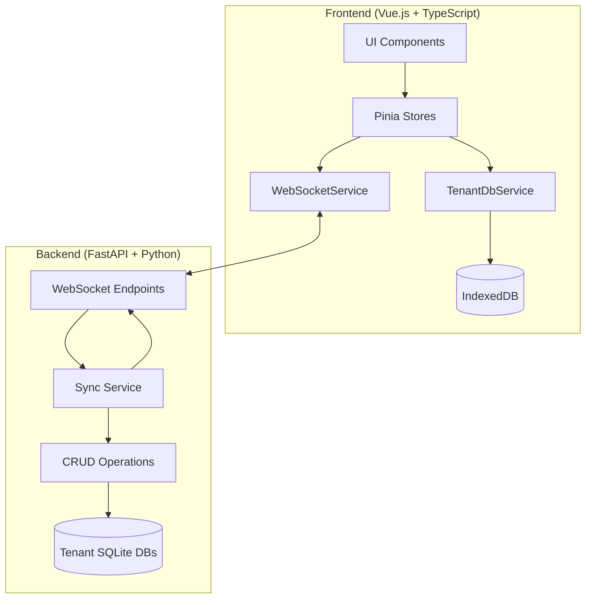
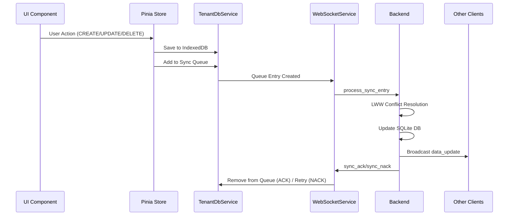
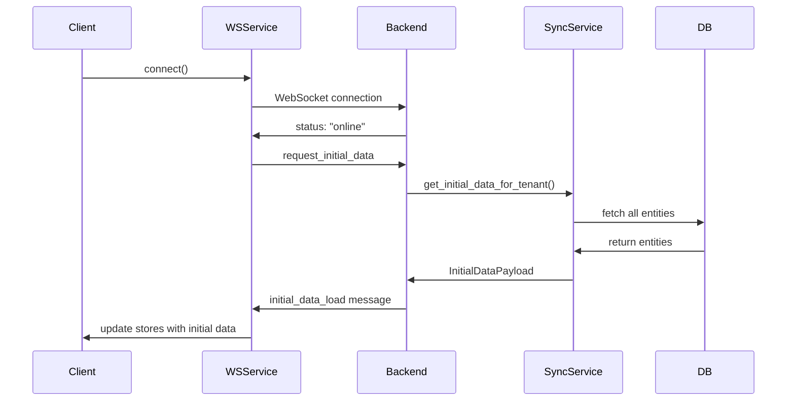

# FinWise Sync-Service - Umfassende Architekturdokumentation

## Inhaltsverzeichnis

1. [Architektur-Übersicht](#1-architektur-übersicht)
2. [Datenfluss-Architektur](#2-datenfluss-architektur)
3. [Backend-Synchronisation-Pattern](#3-backend-synchronisation-pattern)
4. [Frontend-Synchronisation-Pattern](#4-frontend-synchronisation-pattern)
5. [Implementierungsanweisung für neue Entities](#5-implementierungsanweisung-für-neue-entities)
6. [Code-Templates und Patterns](#6-code-templates-und-patterns)
7. [Conflict-Resolution und LWW-Strategien](#7-conflict-resolution-und-lww-strategien)
8. [Error-Handling und Recovery](#8-error-handling-und-recovery)
9. [Performance-Optimierungen](#9-performance-optimierungen)
10. [Testing-Patterns](#10-testing-patterns)
11. [Troubleshooting-Guide](#11-troubleshooting-guide)

---

## 1. Architektur-Übersicht

### 1.1 System-Architektur



### 1.2 Technologie-Stack

| Ebene | Technologie | Zweck |
|-------|-------------|-------|
| **API** | FastAPI + Uvicorn | REST- und WebSocket-Endpoints |
| **Auth** | OAuth2 + JWT + bcrypt | Authentifizierung und Autorisierung |
| **Multi-Tenancy** | Zentrale `auth.db` + pro Mandant `data/{tenant}.db` | Datenisolation |
| **ORM** | SQLAlchemy 2 (Core + ORM) | Typed Models, Migrations |
| **Sync** | WebSockets + IndexedDB (Dexie) | Offline-First Synchronisation |
| **IDs** | UUID v4 | Kollisionfreie IDs im Offline-Modus |
| **Frontend** | Vue 3 + Pinia + TypeScript + Tailwind CSS | UI-Framework und State Management |

### 1.3 Kernprinzipien

- **Offline-First**: Alle Änderungen werden zunächst lokal gespeichert
- **Last-Writer-Wins (LWW)**: Konfliktlösung basierend auf `updated_at` Timestamps
- **Queue-basierte Synchronisation**: Änderungen werden in einer Sync-Queue gesammelt
- **ACK/NACK-Protokoll**: Jede Synchronisation wird bestätigt oder abgelehnt
- **Transaktionale Konsistenz**: Dexie-Transaktionen für atomare Operationen

---

## 2. Datenfluss-Architektur

### 2.1 Kompletter Sync-Zyklus



### 2.2 Initial Data Load



### 2.3 Queue-Status-Lifecycle

```
PENDING → PROCESSING → COMPLETED (removed)
    ↑         ↓
    └─── FAILED ←─── TIMEOUT
         ↓
    PENDING (retry)
```

---

## 3. Backend-Synchronisation-Pattern

### 3.1 WebSocket-Endpoint-Struktur

**Datei:** `../FinWise_0.4_BE/app/websocket/endpoints.py`

#### Hauptkomponenten:
- **Message-Routing** basierend auf `message_type`
- **Pydantic-Validierung** für eingehende Nachrichten
- **Error-Handling** mit strukturierten NACK-Responses
- **Sync-Service-Integration** für CRUD-Operationen

#### Unterstützte Message-Types:
```python
# Client → Server
'process_sync_entry'     # CRUD-Operationen
'request_initial_data'   # Initiale Datenladung
'data_status_request'    # Datenstatusabfrage
'ping'                   # Connection-Health-Check

# Server → Client
'sync_ack'              # Erfolgreiche Synchronisation
'sync_nack'             # Fehlgeschlagene Synchronisation
'data_update'           # Datenänderung vom Server
'initial_data_load'     # Initiale Daten
'status'                # Backend-Status
```

### 3.2 Sync-Service-Pattern

**Datei:** `../FinWise_0.4_BE/app/services/sync_service.py`

#### Kernfunktionen:

**1. `process_sync_entry()` - Hauptverarbeitungslogik**
```python
async def process_sync_entry(entry: SyncQueueEntry, source_websocket: Optional[WebSocket] = None) -> tuple[bool, Optional[str]]:
    """
    Verarbeitet einen Sync-Eintrag mit LWW-Conflict-Resolution

    Returns:
        tuple[bool, Optional[str]]: (success, error_reason)
    """
    # LWW-Logik
    if incoming_updated_at and existing_entity.updatedAt and incoming_updated_at > existing_entity.updatedAt:
        # Eingehende Änderung gewinnt
        updated_entity = crud_service.update_entity(db=db, db_entity=existing_entity, entity_in=payload)
        notification_data = EntityPayload.model_validate(updated_entity)
    else:
        # Bestehende Daten gewinnen - sende authoritative Daten zurück
        notification_data = EntityPayload.model_validate(existing_entity)
        authoritative_data_used = True

    # Broadcast an andere Clients
    if notification_data:
        message = DataUpdateNotificationMessage(
            event_type=ServerEventType.DATA_UPDATE,
            tenant_id=entry.tenantId,
            entity_type=entity_type,
            operation_type=effective_operation_type,
            data=notification_data
        )
        await websocket_manager_instance.broadcast_json_to_tenant(
            message.model_dump(),
            entry.tenantId,
            exclude_websocket=source_websocket
        )
```

**2. `get_initial_data_for_tenant()` - Initiale Datenladung**
```python
async def get_initial_data_for_tenant(tenant_id: str) -> tuple[Optional[InitialDataPayload], Optional[str]]:
    """Lädt alle initialen Daten für einen Tenant"""
    accounts_db = crud_account.get_accounts(db=db)
    account_groups_db = crud_account_group.get_account_groups(db=db)

    accounts_payload = [AccountPayload.model_validate(acc) for acc in accounts_db]
    account_groups_payload = [AccountGroupPayload.model_validate(ag) for ag in account_groups_db]

    return InitialDataPayload(
        accounts=accounts_payload,
        account_groups=account_groups_payload
    ), None
```

### 3.3 CRUD-Operation-Patterns

#### CREATE-Operation:
```python
if operation_type == SyncOperationType.CREATE:
    existing_entity = crud_service.get_entity(db=db, entity_id=entity_id)
    if existing_entity:  # ID-Kollision - behandle als UPDATE
        if incoming_updated_at and existing_entity.updatedAt and incoming_updated_at > existing_entity.updatedAt:
            updated_entity = crud_service.update_entity(db=db, db_entity=existing_entity, entity_in=payload)
            notification_data = EntityPayload.model_validate(updated_entity)
        else:
            notification_data = EntityPayload.model_validate(existing_entity)
            authoritative_data_used = True
    else:
        new_entity = crud_service.create_entity(db=db, entity_in=payload)
        notification_data = EntityPayload.model_validate(new_entity)
```

#### UPDATE-Operation:
```python
elif operation_type == SyncOperationType.UPDATE:
    db_entity = crud_service.get_entity(db=db, entity_id=entity_id)
    if db_entity:
        if incoming_updated_at and db_entity.updatedAt and incoming_updated_at > db_entity.updatedAt:
            updated_entity = crud_service.update_entity(db=db, db_entity=db_entity, entity_in=payload)
            notification_data = EntityPayload.model_validate(updated_entity)
        else:
            notification_data = EntityPayload.model_validate(db_entity)
            authoritative_data_used = True
    else:
        # Upsert-Verhalten
        new_entity = crud_service.create_entity(db=db, entity_in=payload)
        notification_data = EntityPayload.model_validate(new_entity)
```

#### DELETE-Operation:
```python
elif operation_type == SyncOperationType.DELETE:
    deleted_entity = crud_service.delete_entity(db=db, entity_id=entity_id)
    if deleted_entity:
        notification_data = DeletePayload(id=entity_id)
    else:
        # Idempotente Löschung
        notification_data = DeletePayload(id=entity_id)
        authoritative_data_used = True
```

### 3.4 Error-Handling-Pattern

#### Strukturierte Error-Reasons:
```python
try:
    # CRUD-Operation
    pass
except sqlite3.OperationalError as oe:
    error_reason = "database_operational_error"
    if "no such table" in str(oe).lower():
        error_reason = "table_not_found"
    return False, error_reason
except ValidationError as ve:
    return False, "validation_error"
except Exception as e:
    return False, "generic_processing_error"
```

#### NACK-Response-Struktur:
```python
nack_message = SyncNackMessage(
    id=entry.id,
    entityId=entry.entityId,
    entityType=entry.entityType,
    operationType=entry.operationType,
    reason=error_reason,
    detail=detailed_error_message
)
```

---

## 4. Frontend-Synchronisation-Pattern

### 4.1 WebSocketService-Architektur

**Datei:** `src/services/WebSocketService.ts`

#### Kernkomponenten:

**1. Connection-Management:**
```typescript
// Automatische Reconnection mit exponential backoff
handleReconnection(): void {
    if (reconnectAttempts < MAX_RECONNECT_ATTEMPTS) {
        reconnectAttempts++;
        setTimeout(() => {
            this.connect();
        }, RECONNECT_INTERVAL);
    } else {
        this.startLongTermReconnection();
    }
}

// Health-Check-Mechanismen
startBackendHealthChecks(): void {
    backendHealthCheckTimer = setInterval(async () => {
        const response = await fetch(`${healthUrl}`);
        if (response.ok && (!socket || socket.readyState !== WebSocket.OPEN)) {
            this.connect();
        }
    }, BACKEND_HEALTH_CHECK_INTERVAL);
}
```

**2. Sync-Queue-Processing:**
```typescript
async processSyncQueue(): Promise<void> {
    if (isSyncProcessRunning) return;
    isSyncProcessRunning = true;

    try {
        // Dexie-Transaktion für atomare Verarbeitung
        await activeDB.transaction('rw', activeDB.syncQueue, async (tx) => {
            const pendingEntries = await tx.table<SyncQueueEntry, string>('syncQueue')
                .where({ tenantId: currentTenantId, status: SyncStatus.PENDING })
                .sortBy('timestamp');

            for (const entry of pendingEntries) {
                // Status auf PROCESSING setzen
                await tx.table('syncQueue').update(entry.id, {
                    status: SyncStatus.PROCESSING,
                    attempts: (entry.attempts ?? 0) + 1,
                    lastAttempt: Date.now(),
                });

                // Nachricht senden
                const sent = this.sendMessage({
                    type: 'process_sync_entry',
                    payload: entry,
                });

                if (!sent) {
                    // Bei Sendefehler zurück auf PENDING
                    await tx.table('syncQueue').update(entry.id, {
                        status: SyncStatus.PENDING,
                        error: 'Failed to send to WebSocket',
                    });
                }
            }
        });
    } finally {
        isSyncProcessRunning = false;
    }
}
```

**3. Message-Handling:**
```typescript
// LWW-Integration bei eingehenden Updates
if (message.event_type === 'data_update') {
    const updateMessage = message as DataUpdateNotificationMessage;

    // Prüfe Tenant-ID
    if (updateMessage.tenant_id !== tenantStore.activeTenantId) {
        return;
    }

    // Verarbeitung basierend auf entity_type
    switch (updateMessage.entity_type) {
        case EntityTypeEnum.ACCOUNT:
            const accountData = updateMessage.data as Account | DeletePayload;
            if (updateMessage.operation_type === SyncOperationType.CREATE) {
                await accountStore.addAccount(accountData as Account, true); // fromSync = true
            } else if (updateMessage.operation_type === SyncOperationType.UPDATE) {
                await accountStore.updateAccount(accountData as Account, true);
            } else if (updateMessage.operation_type === SyncOperationType.DELETE) {
                await accountStore.deleteAccount(accountData.id, true);
            }
            break;
        // ... weitere Entity-Types
    }
}
```

### 4.2 Store-Integration-Pattern

**Datei:** `src/stores/accountStore.ts`

#### LWW-Implementierung in Stores:

```typescript
async function addAccount(accountData: Account, fromSync = false): Promise<Account> {
    const accountWithTimestamp: Account = {
        ...accountData,
        updated_at: accountData.updated_at || new Date().toISOString(),
    };

    if (fromSync) {
        // LWW-Logik für eingehende Sync-Daten
        const localAccount = await tenantDbService.getAccountById(accountWithTimestamp.id);
        if (localAccount && localAccount.updated_at && accountWithTimestamp.updated_at &&
            new Date(localAccount.updated_at) >= new Date(accountWithTimestamp.updated_at)) {
            // Lokale Daten sind neuer - eingehende Änderung verwerfen
            return localAccount;
        }
    }

    // Lokale DB aktualisieren
    await tenantDbService.addAccount(accountWithTimestamp);

    // Store aktualisieren
    const existingIndex = accounts.value.findIndex(a => a.id === accountWithTimestamp.id);
    if (existingIndex === -1) {
        accounts.value.push(accountWithTimestamp);
    } else {
        if (!fromSync || (accountWithTimestamp.updated_at &&
            new Date(accountWithTimestamp.updated_at) > new Date(accounts.value[existingIndex].updated_at!))) {
            accounts.value[existingIndex] = accountWithTimestamp;
        }
    }

    // Sync-Queue-Eintrag für lokale Änderungen
    if (!fromSync) {
        await tenantDbService.addSyncQueueEntry({
            entityType: EntityTypeEnum.ACCOUNT,
            entityId: accountWithTimestamp.id,
            operationType: SyncOperationType.CREATE,
            payload: accountWithTimestamp,
        });
    }

    return accountWithTimestamp;
}
```

### 4.3 TenantDbService-Integration

**Datei:** `src/services/TenantDbService.ts`

#### Sync-Queue-Management:

```typescript
async addSyncQueueEntry(
    entryData: Omit<SyncQueueEntry, 'id' | 'timestamp' | 'status' | 'tenantId'>,
): Promise<SyncQueueEntry | null> {
    const newEntry: SyncQueueEntry = {
        ...entryData,
        id: uuidv4(),
        tenantId: tenantStore.activeTenantId!,
        timestamp: Date.now(),
        status: SyncStatus.PENDING,
        attempts: 0,
    };

    await this.db.syncQueue.add(newEntry);
    return newEntry;
}

// DELETE-Operation-Protection
async getPendingDeleteOperations(tenantId: string): Promise<{accounts: string[], accountGroups: string[]}> {
    const pendingDeletes = await this.db.syncQueue
        .where({ tenantId, operationType: 'delete' })
        .and(entry => entry.status === SyncStatus.PENDING || entry.status === SyncStatus.PROCESSING)
        .toArray();

    const accounts: string[] = [];
    const accountGroups: string[] = [];

    for (const entry of pendingDeletes) {
        if (entry.entityType === 'Account') {
            accounts.push(entry.entityId);
        } else if (entry.entityType === 'AccountGroup') {
            accountGroups.push(entry.entityId);
        }
    }

    return { accounts, accountGroups };
}
```

---

## 5. Implementierungsanweisung für neue Entities

### 5.1 Backend-Implementierung

#### Schritt 1: Datenmodell definieren

```python
# app/models/financial_models.py
class Category(TenantBase):
    __tablename__ = "categories"

    id = Column(String, primary_key=True, index=True)
    name = Column(String, nullable=False)
    description = Column(String)
    color = Column(String)
    icon = Column(String)
    parentCategoryId = Column(String, ForeignKey("categories.id"))
    isActive = Column(Boolean, default=True)
    sortOrder = Column(Integer, default=0)
    createdAt = Column(DateTime, default=datetime.utcnow)
    updatedAt = Column(DateTime, default=datetime.utcnow, onupdate=datetime.utcnow)
```

#### Schritt 2: CRUD-Service erstellen

```python
# app/crud/crud_category.py
from app.crud.base import CRUDBase
from app.models.financial_models import Category
from app.websocket.schemas import CategoryPayload

class CRUDCategory(CRUDBase[Category, CategoryPayload, CategoryPayload]):
    def get_category(self, db: Session, *, category_id: str) -> Optional[Category]:
        return db.query(Category).filter(Category.id == category_id).first()

    def get_categories(self, db: Session, *, skip: int = 0, limit: int = 100) -> List[Category]:
        return db.query(Category).offset(skip).limit(limit).all()

    def create_category(self, db: Session, *, category_in: CategoryPayload) -> Category:
        db_category = Category(**category_in.model_dump())
        db.add(db_category)
        db.commit()
        db.refresh(db_category)
        return db_category

    def update_category(self, db: Session, *, db_category: Category, category_in: CategoryPayload) -> Category:
        update_data = category_in.model_dump(exclude_unset=True)
        for field, value in update_data.items():
            setattr(db_category, field, value)
        db_category.updatedAt = datetime.utcnow()
        db.commit()
        db.refresh(db_category)
        return db_category

    def delete_category(self, db: Session, *, category_id: str) -> Optional[Category]:
        category = self.get_category(db, category_id=category_id)
        if category:
            db.delete(category)
            db.commit()
        return category

crud_category = CRUDCategory(Category)
```

#### Schritt 3: WebSocket-Schema erweitern

```python
# app/websocket/schemas.py
class EntityType(Enum):
    ACCOUNT = "Account"
    ACCOUNT_GROUP = "AccountGroup"
    CATEGORY = "Category"  # Neue Entity hinzufügen

class CategoryPayload(BaseModel):
    id: str
    name: str
    description: Optional[str] = None
    color: Optional[str] = None
    icon: Optional[str] = None
    parentCategoryId: Optional[str] = None
    isActive: bool = True
    sortOrder: int = 0
    updated_at: Optional[datetime.datetime] = None

    class Config:
        use_enum_values = True
        from_attributes = True

# Union-Type erweitern
SyncEntryDataPayload = Union[AccountPayload, AccountGroupPayload, CategoryPayload, DeletePayload, None]
```

#### Schritt 4: Sync-Service erweitern

```python
# app/services/sync_service.py - in process_sync_entry()
elif entity_type == EntityType.CATEGORY:
    if not isinstance(payload, (CategoryPayload, DeletePayload)) and operation_type != SyncOperationType.DELETE:
        error_msg = "Invalid payload type for Category operation"
        return False, error_msg

    if operation_type == SyncOperationType.CREATE:
        existing_category = crud_category.get_category(db=db, category_id=entity_id)
        if existing_category:
            if incoming_updated_at and existing_category.updatedAt and incoming_updated_at > existing_category.updatedAt:
                updated_category = crud_category.update_category(db=db, db_category=existing_category, category_in=payload)
                notification_data = CategoryPayload.model_validate(updated_category)
            else:
                notification_data = CategoryPayload.model_validate(existing_category)
                authoritative_data_used = True
        else:
            new_category = crud_category.create_category(db=db, category_in=payload)
            notification_data = CategoryPayload.model_validate(new_category)

    elif operation_type == SyncOperationType.UPDATE:
        db_category = crud_category.get_category(db=db, category_id=entity_id)
        if db_category:
            if incoming_updated_at and db_category.updatedAt and incoming_updated_at > db_category.updatedAt:
                updated_category = crud_category.update_category(db=db, db_category=db_category, category_in=payload)
                notification_data = CategoryPayload.model_validate(updated_category)
            else:
                notification_data = CategoryPayload.model_validate(db_category)
                authoritative_data_used = True
        else:
            new_category = crud_category.create_category(db=db, category_in=payload)
            notification_data = CategoryPayload.model_validate(new_category)

    elif operation_type == SyncOperationType.DELETE:
        deleted_category = crud_category.delete_category(db=db, category_id=entity_id)
        notification_data = DeletePayload(id=entity_id)
```

### 5.2 Frontend-Implementierung

#### Schritt 1: TypeScript-Types erweitern

```typescript
// src/types/index.ts
export interface Category {
  id: string;
  name: string;
  description?: string;
  color?: string;
  icon?: string;
  parentCategoryId?: string;
  isActive: boolean;
  sortOrder: number;
  updated_at?: string;
}

export enum EntityTypeEnum {
  ACCOUNT = 'Account',
  ACCOUNT_GROUP = 'AccountGroup',
  CATEGORY = 'Category',  // Neue Entity hinzufügen
}
```

#### Schritt 2: TenantDbService erweitern

```typescript
// src/services/TenantDbService.ts
export class TenantDbService {
  async addCategory(category: Category): Promise<void> {
    if (!this.db) throw new Error('Keine aktive Mandanten-DB verfügbar.');
    await this.db.categories.put(category);
  }

  async updateCategory(category: Category): Promise<void> {
    if (!this.db) throw new Error('Keine aktive Mandanten-DB verfügbar.');
    await this.db.categories.put(category);
  }

  async deleteCategory(categoryId: string): Promise<void> {
    if (!this.db) throw new Error('Keine aktive Mandanten-DB verfügbar.');
    await this.db.categories.delete(categoryId);
  }

  async getCategoryById(categoryId: string): Promise<Category | undefined> {
    if (!this.db) return undefined;
    return await this.db.categories.get(categoryId);
  }

  async getAllCategories(): Promise<Category[]> {
    if (!this.db) return [];
    return await this.db.categories.toArray();
  }
}
```

#### Schritt 3: Pinia-Store erstellen

```typescript
// src/stores/categoryStore.ts
import { defineStore } from 'pinia';
import { ref, computed } from 'vue';
import type { Category } from '@/types';
import { SyncOperationType, EntityTypeEnum } from '@/types';
import { TenantDbService } from '@/services/TenantDbService';

export const useCategoryStore = defineStore('category', () => {
  const tenantDbService = new TenantDbService();
  const categories = ref<Category[]>([]);

  const activeCategories = computed(() =>
    categories.value.filter(c => c.isActive)
  );

  async function addCategory(categoryData: Category, fromSync = false): Promise<Category> {
    const categoryWithTimestamp: Category = {
      ...categoryData,
      updated_at: categoryData.updated_at || new Date().toISOString(),
    };

    if (fromSync) {
      // LWW-Logik für eingehende Sync-Daten
      const localCategory = await tenantDbService.getCategoryById(categoryWithTimestamp.id);
      if (localCategory && localCategory.updated_at && categoryWithTimestamp.updated_at &&
          new Date(localCategory.updated_at) >= new Date(categoryWithTimestamp.updated_at)) {
        return localCategory; // Lokale Daten sind neuer
      }
    }

    await tenantDbService.addCategory(categoryWithTimestamp);

    // Store aktualisieren
    const existingIndex = categories.value.findIndex(c => c.id === categoryWithTimestamp.id);
    if (existingIndex === -1) {
      categories.value.push(categoryWithTimestamp);
    } else {
      categories.value[existingIndex] = categoryWithTimestamp;
    }

    // Sync-Queue-Eintrag für lokale Änderungen
    if (!fromSync) {
      await tenantDbService.addSyncQueueEntry({
        entityType: EntityTypeEnum.CATEGORY,
        entityId: categoryWithTimestamp.id,
        operationType: SyncOperationType.CREATE,
        payload: categoryWithTimestamp,
      });
    }

    return categoryWithTimestamp;
  }

  // Weitere Methoden analog zu accountStore...

  return {
    categories,
    activeCategories,
    addCategory,
    // updateCategory, deleteCategory, etc.
  };
});
```

#### Schritt 4: WebSocketService erweitern

```typescript
// src/services/WebSocketService.ts - in onmessage handler
switch (updateMessage.entity_type) {
  case EntityTypeEnum.ACCOUNT:
    // ... bestehende Account-Logik
    break;
  case EntityTypeEnum.ACCOUNT_GROUP:
    // ... bestehende AccountGroup-Logik
    break;
  case EntityTypeEnum.CATEGORY:
    const categoryData = updateMessage.data as Category | DeletePayload;
    if (updateMessage.operation_type === SyncOperationType.CREATE) {
      await categoryStore.addCategory(categoryData as Category, true);
    } else if (updateMessage.operation_type === SyncOperationType.UPDATE) {
      await categoryStore.updateCategory(categoryData as Category, true);
    } else if (updateMessage.operation_type === SyncOperationType.DELETE) {
      await categoryStore.deleteCategory(categoryData.id, true);
    }
    break;
}
```

### 5.3 Implementierungs-Checkliste

#### Backend:
- [ ] SQLAlchemy-Modell definieren (mit `updated_at`)
- [ ] Pydantic-Schemas erstellen (Create, Update, Read)
- [ ] CRUD-Service implementieren
- [ ] EntityType-Enum erweitern
- [ ] Payload-Union-Type erweitern
- [ ] Sync-Service um neue Entity erweitern
- [ ] Initial-Data-Load erweitern

#### Frontend:
- [ ] TypeScript-Interface definieren (mit `updated_at`)
- [ ] EntityTypeEnum erweitern
- [ ] TenantDbService-Methoden hinzufügen
- [ ] Pinia-Store erstellen (mit LWW-Logik)
- [ ] WebSocketService-Message-Handling erweitern
- [ ] IndexedDB-Schema erweitern (falls nötig)

---

##
