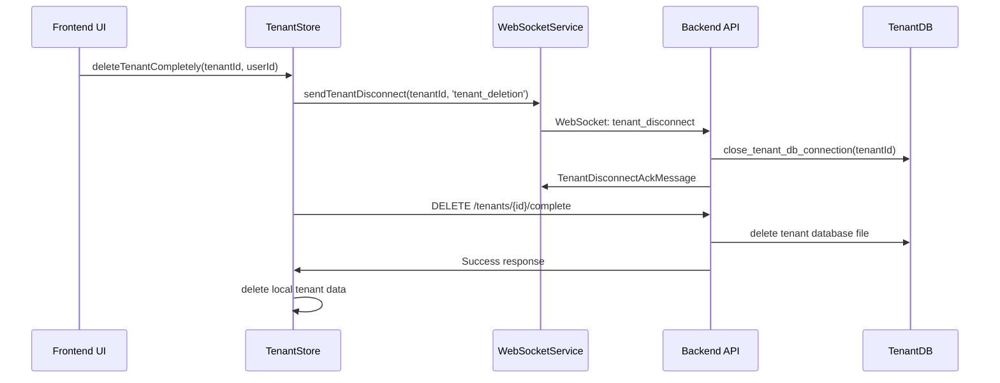

# Mandanten-Löschfunktionalität - Implementierungsdokumentation

## Überblick

Diese Dokumentation beschreibt die vollständige Implementierung der Mandanten-Löschfunktionalität in FinWise, die ein Flag für die Backend-Benachrichtigung bei Mandanten-Abmeldung und die vollständige Löschung von Mandanten sowohl im Frontend als auch Backend ermöglicht.

## Architektur

### 1. Frontend-Backend-Kommunikation



## Implementierte Komponenten

### Frontend

#### 1. SessionStore (`src/stores/sessionStore.ts`)
- **`logoutTenant()`**: Sendet Disconnect-Signal bei Mandanten-Abmeldung
- **`switchTenant()`**: Sendet Disconnect-Signal beim Mandanten-Wechsel

```typescript
async function logoutTenant(): Promise<void> {
  const tenantId = currentTenantId.value;

  if (tenantId) {
    try {
      const { WebSocketService } = await import('@/services/WebSocketService');
      const success = WebSocketService.sendTenantDisconnect(tenantId, 'user_logout');
      // ...
    } catch (error) {
      // Error handling
    }
  }
  // ...
}
```

#### 2. TenantStore (`src/stores/tenantStore.ts`)
- **`deleteTenant()`**: Erweitert um Backend-Signal-Option
- **`deleteTenantCompletely()`**: Vollständige Löschung mit Backend-API

```typescript
async function deleteTenantCompletely(id: string, userId: string): Promise<boolean> {
  try {
    // 1. Backend-Signal senden
    const { WebSocketService } = await import('@/services/WebSocketService');
    WebSocketService.sendTenantDisconnect(id, 'tenant_deletion');

    // 2. Backend-API aufrufen
    await apiService.delete(`/tenants/${id}/complete?user_id=${userId}`);

    // 3. Lokale Löschung
    await userDB.dbTenants.delete(id);
    const dbName = `finwiseTenantDB_${id}`;
    await Dexie.delete(dbName);

    // 4. State bereinigen
    // ...

    return true;
  } catch (err) {
    // Error handling
    return false;
  }
}
```

#### 3. WebSocketService (`src/services/WebSocketService.ts`)
- **`sendTenantDisconnect()`**: Sendet Disconnect-Signal ans Backend

```typescript
sendTenantDisconnect(tenantId: string, reason: string = 'user_logout'): boolean {
  if (!socket || socket.readyState !== WebSocket.OPEN) {
    return false;
  }

  const disconnectMessage: TenantDisconnectMessage = {
    type: 'tenant_disconnect',
    tenant_id: tenantId,
    reason: reason
  };

  return this.sendMessage(disconnectMessage);
}
```

#### 4. UI-Komponente (`src/components/tenant/TenantDeleteDialog.vue`)
- Sicherheitsdialog mit Bestätigungsfeld
- Warnung vor irreversibler Löschung
- Loading-State während Löschung

### Backend

#### 1. Datenbankverbindungs-Management (`app/api/deps.py`)
- **`get_tenant_db()`**: Holt/erstellt Mandanten-DB-Verbindung
- **`close_tenant_db_connection()`**: Schließt spezifische Mandanten-Verbindung
- **`close_all_tenant_connections()`**: Schließt alle Verbindungen

```python
def close_tenant_db_connection(tenant_id: str) -> bool:
    """Schließt die Datenbankverbindung für einen spezifischen Mandanten."""
    if tenant_id not in _tenant_connections:
        return True

    try:
        db = _tenant_connections[tenant_id]
        db.close()
        del _tenant_connections[tenant_id]

        infoLog("deps", f"Successfully closed database connection for tenant {tenant_id}")
        return True
    except Exception as e:
        errorLog("deps", f"Error closing database connection for tenant {tenant_id}")
        return False
```

#### 2. WebSocket-Endpunkte (`app/websocket/endpoints.py`)
- **`tenant_disconnect`** Message-Handler
- **`_handle_tenant_disconnect()`**: Cleanup-Funktion

```python
elif message_type == "tenant_disconnect":
    try:
        tenant_disconnect_message = TenantDisconnectMessage(**message_data)

        # Perform tenant-specific cleanup
        await _handle_tenant_disconnect(tenant_id, tenant_disconnect_message.reason)

        # Send acknowledgment
        ack_message = TenantDisconnectAckMessage(
            tenant_id=tenant_id,
            status="success",
            message="Tenant database resources released successfully"
        )
        await manager.send_personal_json_message(ack_message.model_dump(), websocket)

    except Exception as cleanup_error:
        # Error handling
```

#### 3. Tenant-Service (`app/services/tenant_service.py`)
- **`delete_tenant_completely()`**: Vollständige Mandanten-Löschung
- **`_delete_tenant_database_file()`**: Physische DB-Datei-Löschung

```python
@staticmethod
async def delete_tenant_completely(db: Session, tenant_id: str, user_id: str) -> Optional[models.Tenant]:
    """Löscht einen Mandanten vollständig"""

    # 1. Berechtigung prüfen
    db_tenant = crud.get_tenant(db, tenant_id=tenant_id)
    if db_tenant.user_id != user_id:
        raise PermissionError(f"User {user_id} is not authorized to delete tenant {tenant_id}")

    # 2. WebSocket-Verbindungen schließen
    await manager.close_connections_for_tenant(tenant_id, reason="Tenant deletion process initiated")

    # 3. DB-Datei löschen
    tenant_db_deleted = await TenantService._delete_tenant_database_file(tenant_id)

    # 4. Mandant aus Haupt-DB löschen
    deleted_tenant = crud.delete_tenant(db, tenant_id=tenant_id)

    # 5. WebSocket-Benachrichtigung senden
    await TenantService._notify_tenant_deletion(tenant_id, deleted_tenant.name)

    return deleted_tenant
```

#### 4. API-Endpunkte (`app/routers/tenants.py`)
- **`DELETE /tenants/{tenant_id}/complete`**: Vollständige Mandanten-Löschung
- Berechtigungsprüfung und Validierung

## Sicherheitsfeatures

### 1. Berechtigungsprüfung
- Nur der Mandanten-Owner kann löschen
- User-ID-Validierung in allen Endpunkten

### 2. Bestätigungsdialog
- Mandanten-Name muss exakt eingegeben werden
- Warnung vor irreversibler Löschung
- Loading-State verhindert Doppel-Klicks

### 3. Fehlerbehandlung
- Graceful Fallbacks bei WebSocket-Fehlern
- Detailliertes Logging aller Operationen
- Transaktionale Sicherheit

### 4. Ressourcen-Management
- Automatisches Schließen von DB-Verbindungen
- WebSocket-Verbindungen werden vor Löschung getrennt
- Mehrfache Löschversuche mit Retry-Logik

## Testing

### Automatisierte Tests (`src/test-tenant-deletion.ts`)

```typescript
// Vollständiger Test
await testTenantDeletion(tenantId, userId);

// Nur Disconnect-Signal testen
await testTenantDisconnectOnly(tenantId);

// Individuelle Schritte testen
await testIndividualSteps(tenantId, userId);
```

### Manuelle Tests

1. **Mandanten-Abmeldung testen**:
   ```javascript
   // In Browser-Konsole
   const sessionStore = useSessionStore();
   await sessionStore.logoutTenant();
   ```

2. **Vollständige Löschung testen**:
   ```javascript
   // In Browser-Konsole
   const tenantStore = useTenantStore();
   await tenantStore.deleteTenantCompletely('tenant-id', 'user-id');
   ```

## Verwendung

### 1. UI-Integration

```vue
<template>
  <TenantDeleteDialog
    :is-open="showDeleteDialog"
    :tenant-id="selectedTenant.id"
    :tenant-name="selectedTenant.name"
    @close="showDeleteDialog = false"
    @deleted="onTenantDeleted"
  />
</template>

<script setup>
import TenantDeleteDialog from '@/components/tenant/TenantDeleteDialog.vue';

function onTenantDeleted() {
  // Refresh tenant list, redirect user, etc.
}
</script>
```

### 2. Programmatische Verwendung

```typescript
import { useTenantStore } from '@/stores/tenantStore';
import { useSessionStore } from '@/stores/sessionStore';

const tenantStore = useTenantStore();
const sessionStore = useSessionStore();

// Mandant abmelden (sendet Backend-Signal)
await sessionStore.logoutTenant();

// Mandant vollständig löschen
const success = await tenantStore.deleteTenantCompletely(tenantId, userId);
```

## Logging und Monitoring

### Frontend-Logs
- `debugLog`: Detaillierte Informationen für Entwicklung
- `infoLog`: Wichtige Ereignisse (Löschung erfolgreich)
- `warnLog`: Warnungen (WebSocket nicht verbunden)
- `errorLog`: Fehler bei Löschung

### Backend-Logs
- Alle Operationen werden mit Kontext geloggt
- Fehlerdetails für Debugging
- Performance-Metriken für DB-Operationen

## Bekannte Limitationen

1. **WebSocket-Abhängigkeit**: Disconnect-Signal funktioniert nur bei aktiver WebSocket-Verbindung
2. **Retry-Mechanismus**: Begrenzte Anzahl von Wiederholungsversuchen bei DB-Datei-Löschung
3. **Concurrent Access**: Keine Sperre gegen gleichzeitige Löschversuche

## Zukünftige Erweiterungen

1. **Soft Delete**: Option für reversible Löschung
2. **Backup vor Löschung**: Automatische Sicherung vor Löschung
3. **Batch-Löschung**: Mehrere Mandanten gleichzeitig löschen
4. **Audit-Log**: Detaillierte Protokollierung aller Löschvorgänge

## Troubleshooting

### Häufige Probleme

1. **WebSocket nicht verbunden**:
   - Lösung: Fallback auf HTTP-API für kritische Operationen

2. **DB-Datei kann nicht gelöscht werden**:
   - Lösung: Mehrfache Versuche mit exponential backoff

3. **Berechtigung verweigert**:
   - Lösung: User-ID und Mandanten-Ownership prüfen

### Debug-Befehle

```javascript
// WebSocket-Status prüfen
console.log(WebSocketService.getConnectionStatus());

// Aktive Mandanten-Verbindungen anzeigen
console.log(await fetch('/api/debug/tenant-connections'));

// Test-Suite ausführen
await testTenantDeletion('tenant-id', 'user-id');
