# Architektur-Diagramm: Kategoriegruppen-Struktur für BudgetsView2

## Datenmodell-Architektur

### Bestehende Datenstruktur (unverändert)

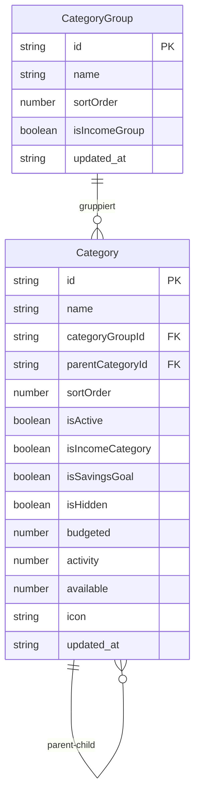

### Neue Logische Struktur (BudgetsView2)

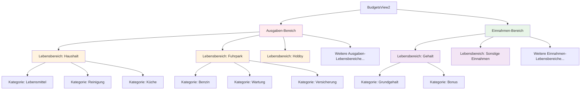

## Komponenten-Architektur

### Hierarchische Struktur

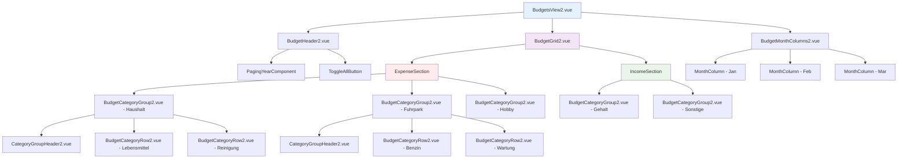

### Datenfluss-Architektur

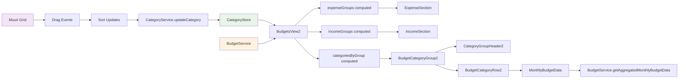

## Muuri-Integration Architektur

### Grid-Layout-Struktur

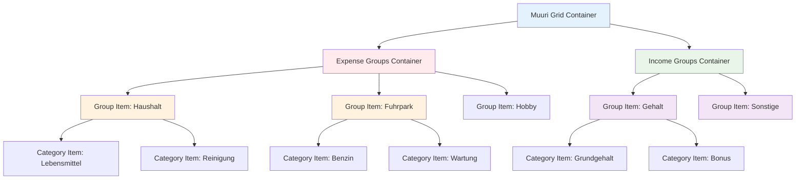

### Drag & Drop Constraints

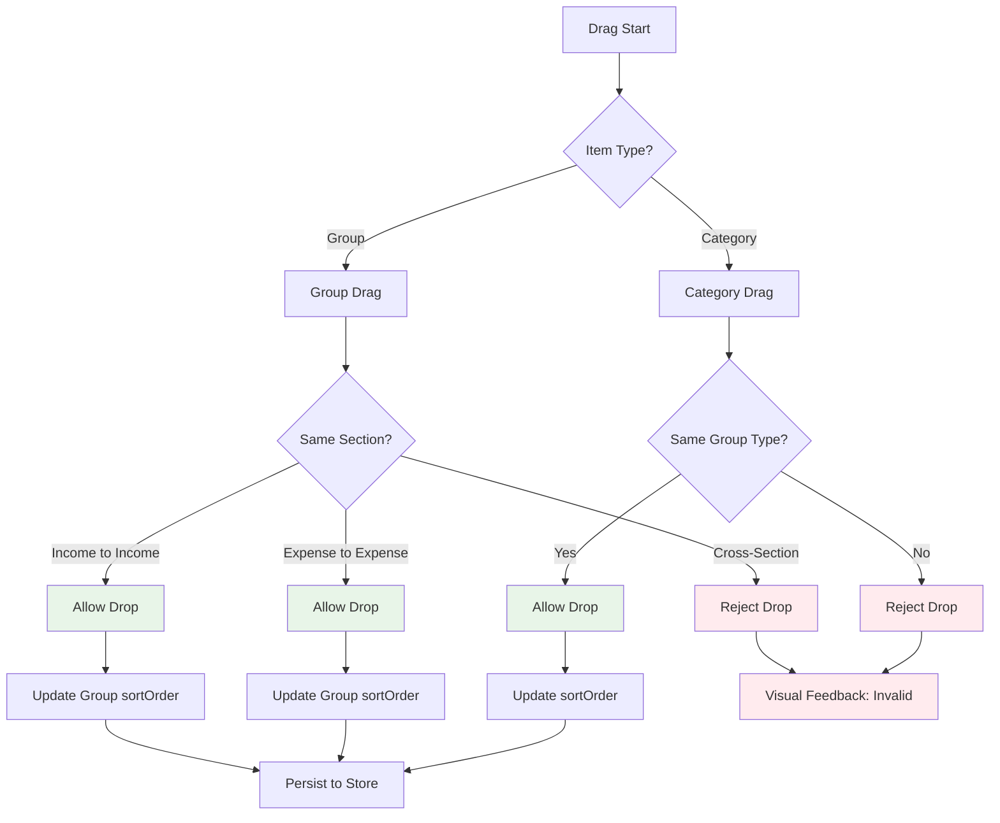

## State Management Architektur

### Lokaler State (BudgetsView2)

```mermaid
graph TD
    A[BudgetsView2 State] --> B[numMonths: ref<number>]
    A --> C[monthOffset: ref<number>]
    A --> D[expandedGroups: ref<Set<string>>]
    A --> E[dragState: ref<DragState>]

    B --> F[localStorage: budget2_months]
    C --> G[localStorage: budget2_offset]
    D --> H[localStorage: budget2_expanded_groups]

    E --> I[isDragging: boolean]
    E --> J[draggedItem: string | null]
    E --> K[dropTarget: string | null]

    style A fill:#e3f2fd
    style F fill:#fff3e0
    style G fill:#fff3e0
    style H fill:#fff3e0
```

### Computed Properties Flow

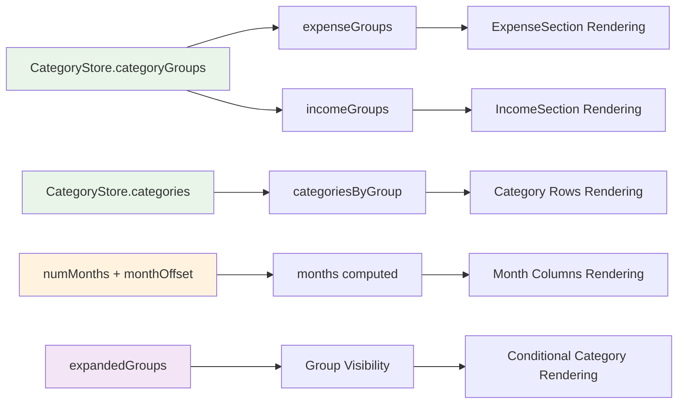

## Layout-Architektur

### Grid-System

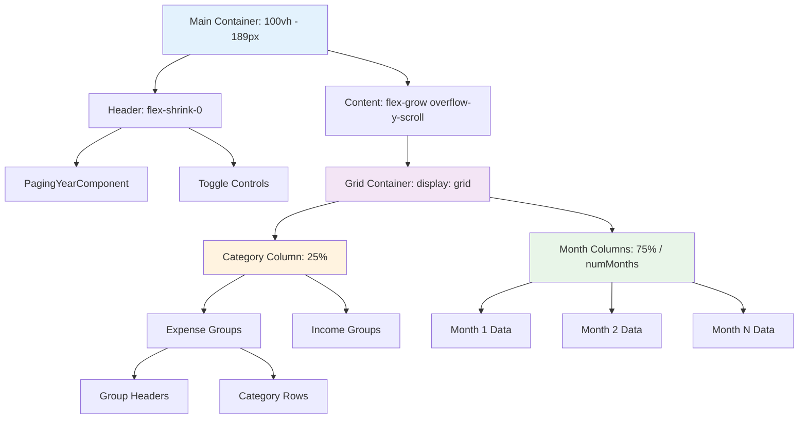

### Responsive Breakpoints

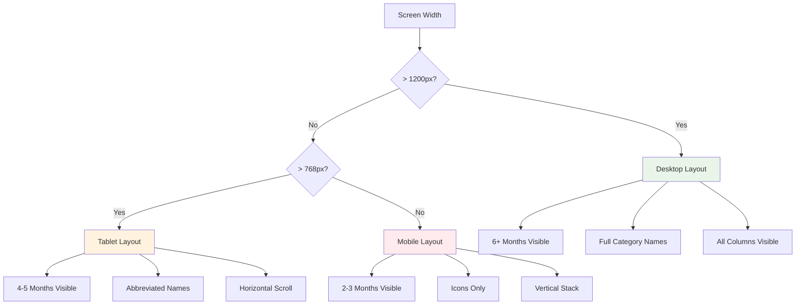

## Performance-Architektur

### Virtualisierung-Strategie

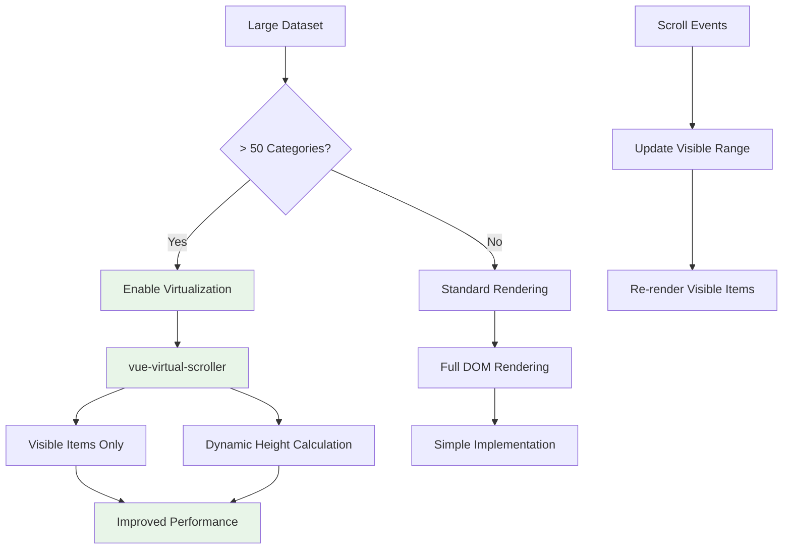

### Lazy Loading-Architektur

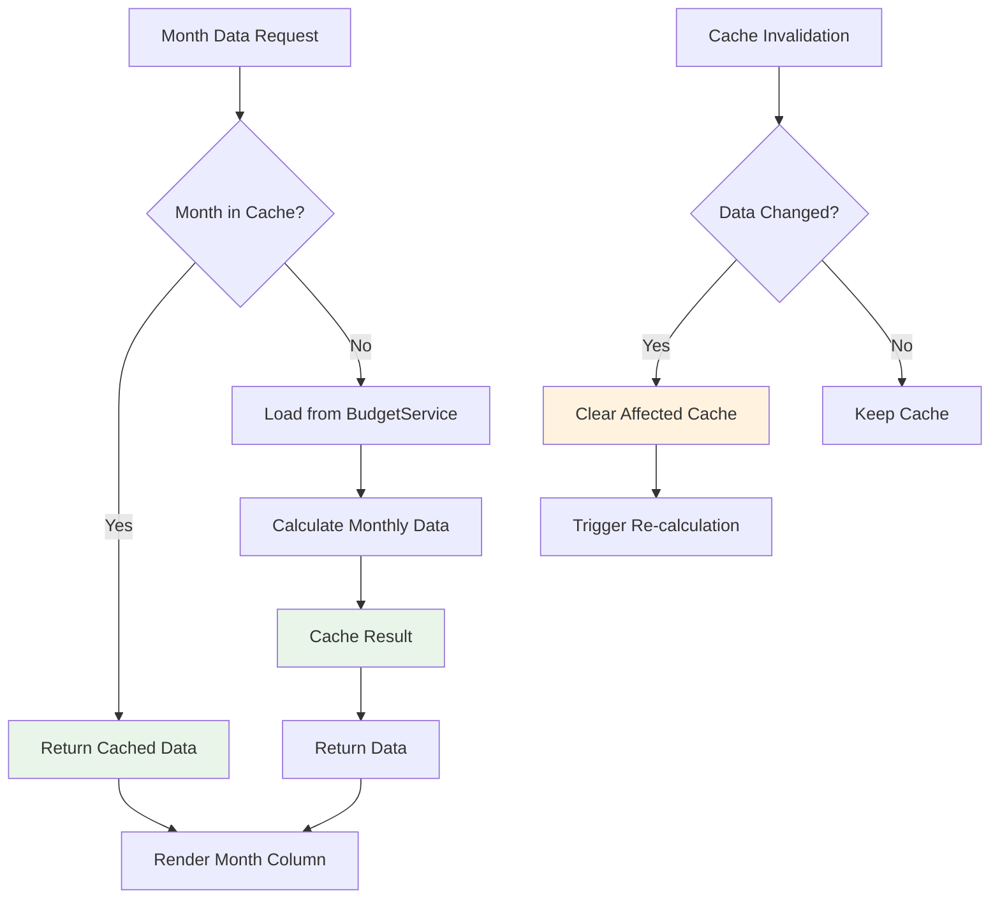

## Fehlerbehandlung-Architektur

### Error Boundaries

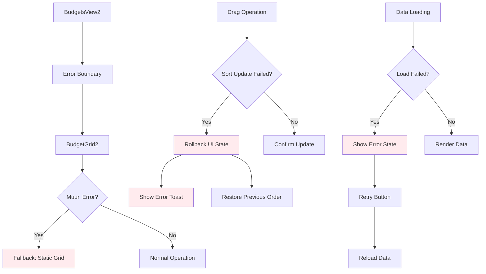

## Accessibility-Architektur

### Keyboard Navigation

```mermaid
graph TD
    A[Focus Management] --> B[Tab Order]
    B --> C[Group Headers]
    B --> D[Category Rows]
    B --> E[Month Columns]

    F[Keyboard Shortcuts] --> G[Space: Toggle Group]
    F --> H[Enter: Edit Mode]
    F --> I[Arrow Keys: Navigate]
    F --> J[Escape: Cancel]

    K[Screen Reader] --> L[ARIA Labels]
    K --> M[Role Attributes]
    K --> N[Live Regions]

    L --> O[Group: "Lebensbereich Haushalt"]
    M --> P[Grid: "Budget-Tabelle"]
    N --> Q[Status: "Kategorie verschoben"]

    style A fill:#e3f2fd
    style F fill:#f3e5f5
    style K fill:#fff3e0
```

Diese Architektur-Dokumentation bietet eine umfassende Übersicht über die strukturellen und technischen Aspekte der neuen BudgetsView2-Implementierung, einschließlich Datenmodell, Komponenten-Hierarchie, State Management und Performance-Optimierungen.
