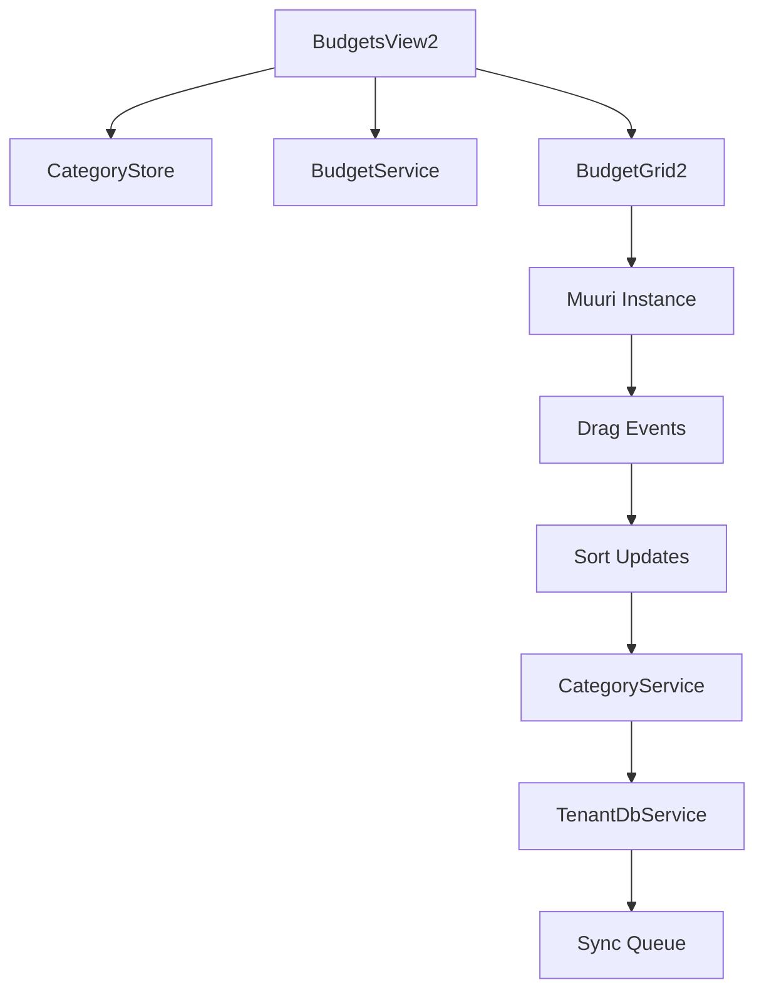

# Implementierungsplan: BudgetsView2 mit Kategoriegruppen

## Überblick

Dieser Plan beschreibt die schrittweise Implementierung der neuen BudgetsView2 basierend auf der PRD. Die Implementierung erfolgt in drei Phasen, um Risiken zu minimieren und kontinuierliche Testbarkeit zu gewährleisten.

## Phase 1: Grundstruktur und Layout (Woche 1)

### 1.1 Navigation und Routing

**Dateien zu ändern:**
- `src/router/index.ts`
- `src/components/ui/MainNavigation.vue`

**Aufgaben:**
1. Neue Route `/budgets2` hinzufügen
2. "Budgets 2" Menüeintrag in MainNavigation einfügen
3. Grundlegende BudgetsView2.vue erstellen

**Code-Beispiel für Router:**
```typescript
// In src/router/index.ts
{
  path: '/budgets2',
  name: 'budgets2',
  component: () => import('@/views/BudgetsView2.vue'),
  meta: { title: 'Budgets 2', breadcrumb: 'Budgets 2' }
}
```

### 1.2 Basis-Komponenten erstellen

**Neue Dateien:**
- `src/views/BudgetsView2.vue` (Hauptview)
- `src/components/budget2/BudgetHeader2.vue` (Header mit Monatsnavigation)
- `src/components/budget2/BudgetGrid2.vue` (Hauptcontainer)
- `src/components/budget2/BudgetCategoryGroup2.vue` (Kategoriegruppen-Container)
- `src/components/budget2/CategoryGroupHeader2.vue` (Gruppen-Header)
- `src/components/budget2/BudgetCategoryRow2.vue` (Einzelne Kategoriezeile)

**Struktur BudgetsView2.vue:**
```vue
<template>
  <div class="h-[calc(100vh-189px)] flex flex-col overflow-hidden">
    <BudgetHeader2
      :numMonths="numMonths"
      :monthOffset="monthOffset"
      @updateStartOffset="onUpdateStartOffset"
      @updateDisplayedMonths="onUpdateDisplayedMonths"
    />
    <BudgetGrid2
      :months="months"
      :categoryGroups="categoryGroups"
      :categories="categories"
    />
  </div>
</template>
```

### 1.3 Datenstruktur und Computed Properties

**Aufgaben:**
1. Kategoriegruppen nach Typ (Ausgaben/Einnahmen) gruppieren
2. Kategorien nach Gruppen organisieren
3. Expand/Collapse-State verwalten
4. Monatsdaten-Berechnung übernehmen

**Code-Beispiel:**
```typescript
const expenseGroups = computed(() =>
  categoryStore.categoryGroups
    .filter(g => !g.isIncomeGroup)
    .sort((a, b) => a.sortOrder - b.sortOrder)
);

const incomeGroups = computed(() =>
  categoryStore.categoryGroups
    .filter(g => g.isIncomeGroup)
    .sort((a, b) => a.sortOrder - b.sortOrder)
);

const categoriesByGroup = computed(() => {
  const grouped: Record<string, Category[]> = {};
  for (const group of categoryStore.categoryGroups) {
    grouped[group.id] = categoryStore.categories
      .filter(c => c.categoryGroupId === group.id && c.isActive)
      .sort((a, b) => a.sortOrder - b.sortOrder);
  }
  return grouped;
});
```

## Phase 2: Muuri-Integration und Drag & Drop (Woche 2)

### 2.1 Muuri-Setup

**Aufgaben:**
1. Muuri-Grid in BudgetGrid2.vue initialisieren
2. Drag-Handles definieren
3. Basis-Drag & Drop ohne Persistierung

**Code-Beispiel:**
```typescript
// In BudgetGrid2.vue
import Muuri from 'muuri';

const grid = ref<HTMLElement | null>(null);
let muuri: Muuri | null = null;

onMounted(() => {
  if (grid.value) {
    muuri = new Muuri(grid.value, {
      items: '.category-group-item, .category-item',
      dragEnabled: true,
      dragHandle: '.drag-handle-2',
      dragSortPredicate: {
        threshold: 50,
        action: 'move'
      },
      layout: {
        fillGaps: false,
        horizontal: false
      }
    });

    // Event-Listener für Drag-Events
    muuri.on('dragEnd', handleDragEnd);
  }
});
```

### 2.2 Drag-Constraints implementieren

**Aufgaben:**
1. Kategorien nur innerhalb gleicher Gruppentypen verschiebbar
2. Gruppen nur innerhalb ihres Typs sortierbar
3. Visuelle Feedback-Mechanismen

**Code-Beispiel:**
```typescript
function handleDragEnd(item: any) {
  const itemElement = item.getElement();
  const isCategory = itemElement.classList.contains('category-item');
  const isGroup = itemElement.classList.contains('category-group-item');

  if (isCategory) {
    handleCategoryDrop(item);
  } else if (isGroup) {
    handleGroupDrop(item);
  }
}

function handleCategoryDrop(item: any) {
  // Logik für Kategorie-Verschiebung
  // Prüfung auf gültigen Drop-Bereich
  // sortOrder-Update
}
```

### 2.3 Sortierung persistieren

**Aufgaben:**
1. sortOrder-Updates in CategoryStore
2. Optimistische Updates mit Rollback
3. Sync-Queue-Integration

**Code-Beispiel:**
```typescript
async function updateCategorySortOrder(categoryId: string, newSortOrder: number, newGroupId?: string) {
  try {
    const updates: Partial<Category> = {
      sortOrder: newSortOrder,
      updated_at: new Date().toISOString()
    };

    if (newGroupId) {
      updates.categoryGroupId = newGroupId;
    }

    await CategoryService.updateCategory(categoryId, updates);
  } catch (error) {
    // Rollback-Logik
    errorLog('BudgetGrid2', 'Fehler beim Aktualisieren der Sortierung', error);
  }
}
```

## Phase 3: Polish und Optimierung (Woche 3)

### 3.1 Performance-Optimierung

**Aufgaben:**
1. Virtualisierung für große Kategorienlisten
2. Lazy Loading von Monatsdaten
3. Debounced Updates

**Code-Beispiel:**
```typescript
// Virtualisierung mit vue-virtual-scroller
import { RecycleScroller } from 'vue-virtual-scroller';

// Debounced sortOrder Updates
import { debounce } from 'lodash';

const debouncedSortUpdate = debounce(async (updates: SortUpdate[]) => {
  for (const update of updates) {
    await updateCategorySortOrder(update.id, update.sortOrder, update.groupId);
  }
}, 300);
```

### 3.2 Expand/Collapse-Funktionalität

**Aufgaben:**
1. Gruppen-Expand/Collapse implementieren
2. State in localStorage persistieren
3. Animationen hinzufügen

**Code-Beispiel:**
```typescript
const expandedGroups = ref<Set<string>>(new Set());

function toggleGroupExpanded(groupId: string) {
  if (expandedGroups.value.has(groupId)) {
    expandedGroups.value.delete(groupId);
  } else {
    expandedGroups.value.add(groupId);
  }
  saveExpandedState();
}

function saveExpandedState() {
  localStorage.setItem(
    storageKey('budget2_expanded_groups'),
    JSON.stringify([...expandedGroups.value])
  );
}
```

### 3.3 Responsive Design und Styling

**Aufgaben:**
1. Kompakte Darstellung mit kleiner Schrift
2. Responsive Spaltenbreiten
3. Hover-Effekte und Drag-Feedback

**CSS-Beispiel:**
```css
.budget-grid-2 {
  @apply relative;
  font-size: 0.75rem; /* Kleine Schrift für Kompaktheit */
}

.category-group-2 {
  @apply bg-base-100 rounded-lg mb-2 border border-base-300;
  min-height: 40px;
}

.category-row-2 {
  @apply flex items-center px-2 py-1 border-b border-base-200 last:border-b-0;
  min-height: 32px;
}

.drag-handle-2 {
  @apply cursor-move opacity-0 group-hover:opacity-100 transition-opacity;
}

.muuri-item-dragging {
  @apply shadow-lg z-50 rotate-2;
}

.muuri-item-releasing {
  @apply transition-transform duration-300;
}
```

## Technische Spezifikationen

### Komponenten-Hierarchie

```
BudgetsView2.vue
├── BudgetHeader2.vue
│   ├── PagingYearComponent (wiederverwendet)
│   └── ToggleAllButton
├── BudgetGrid2.vue (Muuri-Container)
│   ├── ExpenseSection
│   │   └── BudgetCategoryGroup2.vue (für jede Ausgabengruppe)
│   │       ├── CategoryGroupHeader2.vue
│   │       └── BudgetCategoryRow2.vue (für jede Kategorie)
│   └── IncomeSection
│       └── BudgetCategoryGroup2.vue (für jede Einnahmengruppe)
│           ├── CategoryGroupHeader2.vue
│           └── BudgetCategoryRow2.vue (für jede Kategorie)
└── BudgetMonthColumns2.vue (Monatsspalten)
```

### Datenfluss



### State Management

**Lokaler State (BudgetsView2):**
- `numMonths`: Anzahl angezeigter Monate
- `monthOffset`: Verschiebung der Monatsansicht
- `expandedGroups`: Set der erweiterten Gruppen

**Computed Properties:**
- `months`: Array der anzuzeigenden Monate
- `expenseGroups`: Sortierte Ausgabengruppen
- `incomeGroups`: Sortierte Einnahmengruppen
- `categoriesByGroup`: Kategorien gruppiert nach Gruppen

### Event-Handling

**Drag & Drop Events:**
- `dragStart`: Drag-Beginn, visuelle Hinweise
- `dragMove`: Drag-Bewegung, Drop-Zonen highlighten
- `dragEnd`: Drag-Ende, Sortierung aktualisieren

**UI Events:**
- `toggleGroup`: Gruppe expandieren/kollabieren
- `updateMonths`: Monatsansicht ändern
- `toggleAll`: Alle Gruppen expandieren/kollabieren

## Testing-Strategie

### Unit Tests
- Komponenten-Rendering
- Computed Properties
- Event-Handler

### Integration Tests
- Drag & Drop-Funktionalität
- Sortierung-Persistierung
- Store-Integration

### E2E Tests
- Vollständiger Benutzerworkflow
- Performance mit großen Datenmengen
- Browser-Kompatibilität

## Rollout-Plan

### Entwicklung
1. **Woche 1**: Phase 1 - Grundstruktur
2. **Woche 2**: Phase 2 - Drag & Drop
3. **Woche 3**: Phase 3 - Polish

### Testing
- **Woche 4**: Umfassende Tests und Bug-Fixes
- **Woche 5**: User Acceptance Testing

### Deployment
- **Woche 6**: Produktive Bereitstellung als "Budgets 2"
- **Woche 7**: Feedback-Sammlung und Iterationen

## Risiken und Mitigation

### Technische Risiken
1. **Muuri-Performance**: Mitigation durch Virtualisierung
2. **Drag-Constraints**: Mitigation durch umfassende Tests
3. **State-Synchronisation**: Mitigation durch optimistische Updates

### UX-Risiken
1. **Lernkurve**: Mitigation durch schrittweise Einführung
2. **Feature-Parität**: Mitigation durch systematischen Vergleich
3. **Performance-Wahrnehmung**: Mitigation durch Loading-States

## Erfolgskriterien

1. **Funktionalität**: 100% Feature-Parität mit BudgetsView
2. **Performance**: < 2s Ladezeit für 100+ Kategorien
3. **Usability**: Erfolgreiche Drag & Drop-Operationen in < 3 Sekunden
4. **Stabilität**: < 1% Fehlerrate bei Sortierung-Updates
