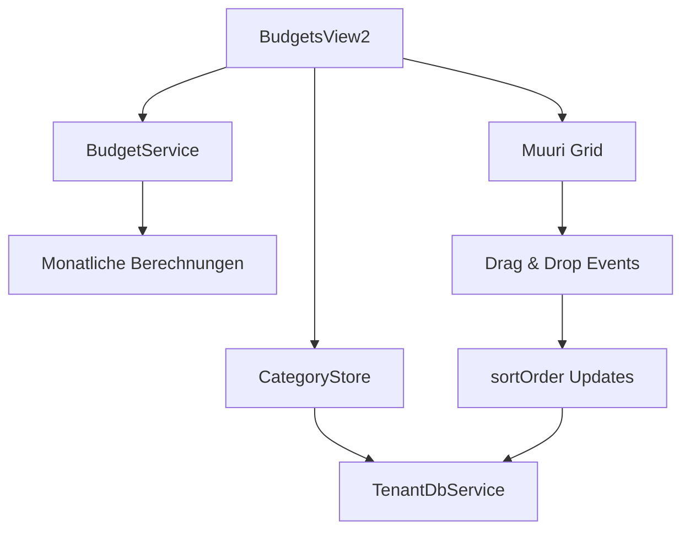

# PRD: Budget-Überarbeitung mit Kategoriegruppen (Lebensbereichen)

## Einführung/Überblick

Die aktuelle BudgetsView in FinWise verwendet eine kaskadierte Kategorienstruktur (Parent-Child), die bei vielen Kategorien grafisch nicht mehr funktioniert und die Übersicht verliert. Diese PRD beschreibt die Überarbeitung zu einer neuen Struktur basierend auf Kategoriegruppen (im UI "Lebensbereiche" genannt), die eine bessere Skalierbarkeit und Benutzerfreundlichkeit bietet.

**Ziel**: Erstellung einer neuen "Budgets 2" View als Vergleichsimplementierung zur bestehenden BudgetsView, mit flacher Kategorienstruktur, gruppierten Lebensbereichen und Drag & Drop-Funktionalität.

## Ziele

1. **Verbesserte Übersichtlichkeit**: Kompakte Darstellung mit kleiner Schrift für maximale Informationsdichte
2. **Flache Kategorienstruktur**: Eliminierung der Parent-Child-Beziehungen zugunsten von Kategoriegruppen
3. **Drag & Drop-Funktionalität**: Intuitive Sortierung und Reorganisation von Kategorien und Gruppen
4. **Skalierbarkeit**: Unterstützung für unbegrenzte Anzahl von Kategorien mit Virtualisierung
5. **Beibehaltung der Funktionalität**: Alle bestehenden Budget-Features bleiben erhalten

## User Stories

### US1: Als Benutzer möchte ich Kategorien nach Lebensbereichen gruppiert sehen
**Akzeptanzkriterien:**
- Ausgabenkategorien werden in Lebensbereichen (Kategoriegruppen) gruppiert dargestellt
- Einnahmenkategorien werden separat in eigenen Lebensbereichen gruppiert
- Lebensbereiche können expandiert/kollabiert werden
- Expand/Collapse-Status wird persistent gespeichert

### US2: Als Benutzer möchte ich Kategorien per Drag & Drop sortieren können
**Akzeptanzkriterien:**
- Kategorien können innerhalb eines Lebensbereichs sortiert werden
- Kategorien können zwischen Lebensbereichen des gleichen Typs verschoben werden
- Lebensbereiche können innerhalb ihres Typs (Ausgaben/Einnahmen) sortiert werden
- Sortierung wird über das `sortOrder`-Feld persistiert

### US3: Als Benutzer möchte ich eine kompakte Budgetübersicht haben
**Akzeptanzkriterien:**
- Kleine Schriftgröße für maximale Informationsdichte
- Alle Budgetinformationen (Budget, Prognose, Ausgegeben, Saldo) bleiben sichtbar
- Horizontales Scrolling für Monate funktioniert weiterhin
- Header bleibt beim Scrollen fixiert

### US4: Als Benutzer möchte ich zwischen alter und neuer Budgetansicht wechseln können
**Akzeptanzkriterien:**
- "Budgets 2" Menüeintrag in der Navigation
- Beide Views funktionieren parallel
- Gleiche Datengrundlage für beide Views

## Funktionale Anforderungen

### FR1: Kategoriegruppen-Darstellung
- Das System MUSS Kategorien nach Kategoriegruppen (Lebensbereichen) gruppiert anzeigen
- Das System MUSS Ausgaben- und Einnahmenkategorien getrennt darstellen
- Das System MUSS Ausgabengruppen vor Einnahmengruppen anzeigen
- Das System MUSS für jede Gruppe einen Expand/Collapse-Button bereitstellen

### FR2: Drag & Drop-Funktionalität
- Das System MUSS Muuri.js für Drag & Drop-Operationen verwenden
- Das System MUSS Kategorien innerhalb einer Gruppe sortierbar machen
- Das System MUSS Kategorien zwischen Gruppen des gleichen Typs verschiebbar machen
- Das System MUSS Gruppen innerhalb ihres Typs sortierbar machen
- Das System MUSS Sortierungen über das `sortOrder`-Feld persistieren

### FR3: Layout und Design
- Das System MUSS eine kompakte Darstellung mit kleiner Schrift verwenden
- Das System MUSS die bestehende Monatsnavigation beibehalten
- Das System MUSS horizontales Scrolling für Monate unterstützen
- Das System MUSS einen fixierten Header beim Scrollen bereitstellen

### FR4: Datenkompatibilität
- Das System MUSS die bestehende Datenstruktur unverändert verwenden
- Das System MUSS mit der bestehenden CategoryStore-Implementierung arbeiten
- Das System MUSS die bestehenden BudgetService-Methoden nutzen
- Das System MUSS JSON-Import/Export-Kompatibilität beibehalten

### FR5: Navigation und Routing
- Das System MUSS einen neuen Route "/budgets2" bereitstellen
- Das System MUSS einen "Budgets 2" Menüeintrag in der MainNavigation hinzufügen
- Das System MUSS beide Budget-Views parallel funktionsfähig halten

## Non-Goals (Out of Scope)

1. **Keine Datenstruktur-Änderungen**: Bestehende CategoryStore und CategoryService bleiben unverändert
2. **Keine Migration**: Keine automatische Konvertierung bestehender Parent-Child-Strukturen
3. **Keine Löschung der alten View**: BudgetsView bleibt als Vergleich bestehen
4. **Keine neuen Budget-Features**: Fokus liegt auf Darstellung und UX-Verbesserung
5. **Keine Mobile-Optimierung**: Fokus auf Desktop-Erfahrung

## Design-Überlegungen

### Komponenten-Architektur
```
BudgetsView2.vue
├── BudgetHeader2.vue (Monatsnavigation + Controls)
├── BudgetGrid2.vue (Hauptcontainer mit Muuri)
│   ├── BudgetCategoryGroup2.vue (Lebensbereich-Container)
│   │   ├── CategoryGroupHeader2.vue (Expand/Collapse + Titel)
│   │   └── BudgetCategoryRow2.vue (Einzelne Kategorie)
│   └── BudgetMonthColumns2.vue (Monatsspalten)
└── BudgetSummary2.vue (Zusammenfassung)
```

### Muuri-Integration
- **Grid-Container**: Hauptcontainer für Drag & Drop
- **Draggable Items**: Kategoriegruppen und einzelne Kategorien
- **Drag Handles**: Spezielle Bereiche für Drag-Initiierung
- **Sort Constraints**: Beschränkung auf gleiche Typen (Ausgaben/Einnahmen)

### Responsive Verhalten
- **Minimale Spaltenbreite**: 120px pro Monat
- **Horizontales Scrolling**: Bei mehr als 6 Monaten
- **Fixierter Header**: Bleibt beim vertikalen Scrollen sichtbar
- **Kompakte Zeilen**: Maximale Informationsdichte

## Technische Überlegungen

### Abhängigkeiten
- **Muuri.js**: Bereits im Projekt vorhanden (siehe AccountsView)
- **Bestehende Stores**: CategoryStore, BudgetService unverändert
- **Vue 3 Composition API**: Konsistent mit bestehender Architektur

### Performance
- **Virtualisierung**: Für große Kategorienlisten (>100 Kategorien)
- **Lazy Loading**: Monatsdaten nur bei Bedarf laden
- **Debounced Sorting**: Sortierung-Updates mit Verzögerung

### Datenfluss


## Erfolgsmetriken

1. **Benutzerfreundlichkeit**: Reduzierte Klicks für Kategorie-Navigation um 50%
2. **Performance**: Ladezeit unter 2 Sekunden für 100+ Kategorien
3. **Skalierbarkeit**: Unterstützung für unbegrenzte Kategorienanzahl
4. **Funktionalität**: 100% Feature-Parität mit bestehender BudgetsView

## Offene Fragen

1. **Gruppierung bestehender Kategorien**: Wie sollen Kategorien ohne `categoryGroupId` behandelt werden?
2. **Standard-Lebensbereiche**: Sollen zusätzliche Standard-Gruppen definiert werden?
3. **Drag-Feedback**: Welche visuellen Hinweise sollen während des Draggings angezeigt werden?
4. **Keyboard-Navigation**: Soll Tastaturnavigation für Accessibility implementiert werden?

## Implementierungsplan

### Phase 1: Grundstruktur
- Neue Route und Navigation
- Basis-Komponenten ohne Drag & Drop
- Layout und Styling

### Phase 2: Muuri-Integration
- Drag & Drop für Kategorien
- Drag & Drop für Gruppen
- Sortierung-Persistierung

### Phase 3: Polish und Testing
- Performance-Optimierung
- Edge-Case-Behandlung
- User Testing und Feedback

## Technische Spezifikationen

### Neue Dateien
- `src/views/BudgetsView2.vue`
- `src/components/budget2/BudgetGrid2.vue`
- `src/components/budget2/BudgetCategoryGroup2.vue`
- `src/components/budget2/CategoryGroupHeader2.vue`
- `src/components/budget2/BudgetCategoryRow2.vue`

### Geänderte Dateien
- `src/components/ui/MainNavigation.vue` (neuer Menüeintrag)
- `src/router/index.ts` (neue Route)

### CSS-Klassen
- `.budget-grid-2`: Hauptcontainer
- `.category-group-2`: Kategoriegruppen-Container
- `.category-row-2`: Einzelne Kategoriezeile
- `.drag-handle-2`: Drag-Bereiche
- `.muuri-item-2`: Muuri-spezifische Klassen
