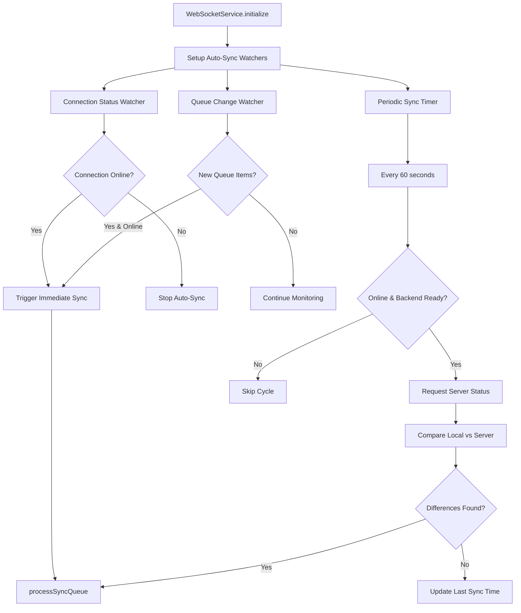
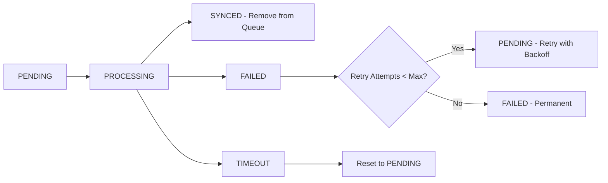
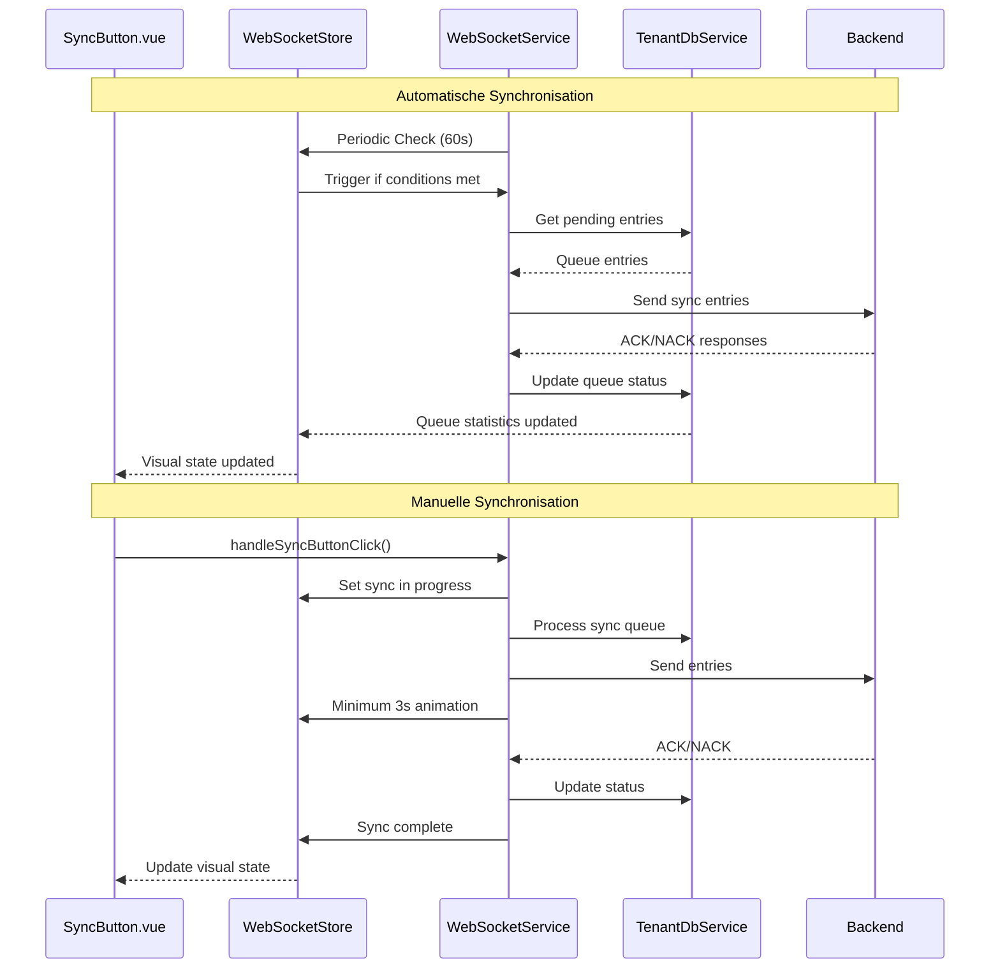

# Architekturplan: Umfassendes Synchronisationssystem mit ACK/NACK-Protokoll

## 1. Überblick der bestehenden Architektur

### Aktuelle Komponenten:
- **SyncButton.vue**: Manuelle Sync-Auslösung mit grundlegenden visuellen Zuständen
- **WebSocketService**: Zentrale WebSocket-Kommunikation mit ACK/NACK-Verarbeitung
- **WebSocketStore**: Pinia-Store für Verbindungs- und Backend-Status
- **TenantDbService**: IndexedDB-Operationen für Sync-Queue-Management

### Bestehende ACK/NACK-Infrastruktur:
✅ **Bereits implementiert:**
- `SyncAckMessage` und `SyncNackMessage` Typen
- `processSyncAck()` und `processSyncNack()` Methoden im WebSocketService
- Retry-Logik mit exponential backoff
- Queue-Status-Management (PENDING, PROCESSING, SYNCED, FAILED)

## 2. Erweiterte SyncButton.vue Architektur

### 2.1 Neue visuelle Zustände

```mermaid
stateDiagram-v2
    [*] --> CheckConnection
    CheckConnection --> Online : WebSocket Connected
    CheckConnection --> Offline : WebSocket Disconnected

    Online --> SyncedOnline : Queue Empty
    Online --> UnsyncedOnline : Queue Has Items
    Online --> SyncingOnline : Manual/Auto Sync Active

    Offline --> SyncedOffline : Queue Empty
    Offline --> UnsyncedOffline : Queue Has Items

    SyncingOnline --> SyncedOnline : Sync Complete & Queue Empty
    SyncingOnline --> UnsyncedOnline : Sync Complete & Queue Has Items
    SyncingOnline --> Offline : Connection Lost

    state SyncedOnline {
        icon: mdi:cloud-check
        color: success/green
        title: "Online & Synchron"
    }

    state UnsyncedOnline {
        icon: mdi:cloud-upload-outline
        color: info/blue
        title: "Online - Lokale Änderungen"
    }

    state SyncedOffline {
        icon: mdi:cloud-off-outline
        color: error/red
        title: "Offline & Synchron"
    }

    state UnsyncedOffline {
        icon: mdi:cloud-alert-outline
        color: error/red
        title: "Offline - Ungesyncte Änderungen"
    }

    state SyncingOnline {
        icon: mdi:sync (rotating)
        color: warning/yellow
        title: "Synchronisiere..."
        duration: 3_seconds_minimum
    }
```

### 2.2 Erweiterte SyncButton.vue Implementierung

**Neue Computed Properties:**
```typescript
// Erweiterte Queue-Status-Erkennung
const queueStatus = computed(async () => {
  if (!tenantStore.activeTenantId) return { isEmpty: true, count: 0 };

  const pendingEntries = await tenantDbService.getPendingSyncEntries(tenantStore.activeTenantId);
  const processingEntries = await tenantDbService.getProcessingSyncEntries(tenantStore.activeTenantId);

  return {
    isEmpty: pendingEntries.length === 0 && processingEntries.length === 0,
    count: pendingEntries.length + processingEntries.length,
    hasPending: pendingEntries.length > 0,
    hasProcessing: processingEntries.length > 0
  };
});

// 3-Sekunden Mindest-Sync-Animation
const syncAnimationState = computed(() => {
  return {
    isActive: isManuallyProcessingSync.value || syncAnimationTimer.value > 0,
    remainingTime: syncAnimationTimer.value
  };
});
```

## 3. Automatische Synchronisation

### 3.1 Architektur-Diagramm



### 3.2 Implementierung der automatischen Synchronisation

**Neue WebSocketService Methoden:**
```typescript
// Automatische Sync-Mechanismen
async initializeAutoSync(): Promise<void> {
  // 1. Sofortige Synchronisation bei neuen Queue-Elementen
  this.setupQueueWatcher();

  // 2. Periodische Server-Abfrage (alle 60 Sekunden)
  this.setupPeriodicSync();

  // 3. Verbindungs-basierte Synchronisation
  this.setupConnectionWatcher();
}

private setupQueueWatcher(): void {
  // Überwacht Änderungen in der Sync-Queue
  // Triggert sofortige Synchronisation bei neuen Einträgen wenn online
}

private setupPeriodicSync(): void {
  // Alle 60 Sekunden Server-Status abfragen
  // Bei Unterschieden automatische Synchronisation starten
}

private async requestServerDataStatus(tenantId: string): Promise<void> {
  // Neue WebSocket-Nachricht: 'request_data_status'
  // Server antwortet mit Checksummen/Timestamps der Entitäten
}
```

## 4. Erweiterte Queue-Management-Strategie

### 4.1 Queue-Status-Tracking



### 4.2 Erweiterte TenantDbService Methoden

**Neue Queue-Management-Funktionen:**
```typescript
// Queue-Statistiken für SyncButton
async getQueueStatistics(tenantId: string): Promise<QueueStatistics> {
  return {
    pendingCount: number,
    processingCount: number,
    failedCount: number,
    lastSyncTime: number | null,
    oldestPendingTime: number | null
  };
}

// Batch-Operationen für bessere Performance
async batchUpdateQueueStatus(
  entryIds: string[],
  newStatus: SyncStatus,
  error?: string
): Promise<number> {
  // Effiziente Batch-Updates in einer Transaktion
}

// Queue-Bereinigung
async cleanupOldEntries(tenantId: string, maxAge: number): Promise<number> {
  // Entfernt alte SYNCED/FAILED Einträge
}
```

## 5. Zustandsverwaltung für Sync-Szenarien

### 5.1 Erweiterte WebSocketStore

**Neue Store-Properties:**
```typescript
// Sync-spezifische Zustände
const syncState = ref<SyncState>({
  isAutoSyncEnabled: true,
  lastAutoSyncTime: null,
  nextAutoSyncTime: null,
  queueStatistics: null,
  syncInProgress: false,
  syncAnimationEndTime: null
});

// Neue Actions
function setSyncInProgress(inProgress: boolean, minimumDuration: number = 3000) {
  syncState.value.syncInProgress = inProgress;
  if (inProgress) {
    syncState.value.syncAnimationEndTime = Date.now() + minimumDuration;
  }
}

function updateQueueStatistics(stats: QueueStatistics) {
  syncState.value.queueStatistics = stats;
}
```

### 5.2 Reactive Sync-Status-Berechnung

```typescript
// Zentraler Sync-Status-Computer
const syncStatus = computed(() => {
  const isOnline = connectionStatus.value === WebSocketConnectionStatus.CONNECTED;
  const hasQueueItems = syncState.value.queueStatistics?.pendingCount > 0 ||
                       syncState.value.queueStatistics?.processingCount > 0;
  const isSyncing = syncState.value.syncInProgress ||
                   (syncState.value.syncAnimationEndTime &&
                    Date.now() < syncState.value.syncAnimationEndTime);

  if (isSyncing) {
    return {
      state: 'syncing',
      icon: 'mdi:sync',
      color: 'warning',
      title: 'Synchronisiere Daten...',
      animate: true
    };
  }

  if (isOnline && !hasQueueItems) {
    return {
      state: 'synced_online',
      icon: 'mdi:cloud-check',
      color: 'success',
      title: 'Online & Synchron',
      animate: false
    };
  }

  if (isOnline && hasQueueItems) {
    return {
      state: 'unsynced_online',
      icon: 'mdi:cloud-upload-outline',
      color: 'info',
      title: 'Online - Lokale Änderungen vorhanden',
      animate: false
    };
  }

  if (!isOnline && !hasQueueItems) {
    return {
      state: 'synced_offline',
      icon: 'mdi:cloud-off-outline',
      color: 'error',
      title: 'Offline & Synchron',
      animate: false
    };
  }

  return {
    state: 'unsynced_offline',
    icon: 'mdi:cloud-alert-outline',
    color: 'error',
    title: 'Offline - Ungesyncte Änderungen vorhanden',
    animate: false
  };
});
```

## 6. Datenfluss-Architektur

### 6.1 Gesamter Datenfluss



## 7. Implementierungsreihenfolge

### Phase 1: Erweiterte SyncButton.vue
1. ✅ Neue visuelle Zustände implementieren
2. ✅ 3-Sekunden Mindest-Animation
3. ✅ Queue-Status-Integration

### Phase 2: Automatische Synchronisation
1. ✅ Periodic Sync Timer (60s)
2. ✅ Queue-Change-Watcher
3. ✅ Connection-Status-Watcher

### Phase 3: Erweiterte Queue-Verwaltung
1. ✅ Queue-Statistiken-API
2. ✅ Batch-Operationen
3. ✅ Cleanup-Mechanismen

### Phase 4: Store-Erweiterungen
1. ✅ Sync-State-Management
2. ✅ Reactive Status-Berechnung
3. ✅ Animation-Timing-Control

## 8. Einhaltung der Code-Regeln

### ✅ Bestehende Methoden bleiben unverändert:
- Alle aktuellen WebSocketService-Methoden behalten ihre Signaturen
- SyncButton.vue `handleSyncButtonClick()` wird nur erweitert, nicht umbenannt
- Store-Actions bleiben kompatibel

### ✅ Änderungen nur in Stores (außer nach Rückfrage):
- Neue Funktionalität wird primär in Stores implementiert
- Service-Erweiterungen werden explizit abgestimmt
- UI-Komponenten-Änderungen werden dokumentiert und abgestimmt

### ✅ Modularisierung bei komplexer Logik:
- Sync-Status-Berechnung in eigene Computed Properties
- Queue-Management in separate Service-Methoden
- Animation-Timing in eigene Hilfsfunktionen

## 9. Nächste Schritte

1. **Dokumentation strukturieren** - Aufteilen in separate Dateien im docs-Verzeichnis
2. **API-Spezifikation** - Detaillierte WebSocket-Nachrichten definieren
3. **Implementierungsdetails** - Konkrete Code-Beispiele und Interfaces
4. **Testing-Strategie** - Unit- und Integrationstests planen

Dieser Architekturplan bietet eine saubere, wartbare Lösung, die das bestehende ACK/NACK-System erweitert und alle geforderten Funktionen implementiert, während die bestehenden Code-Regeln eingehalten werden.
